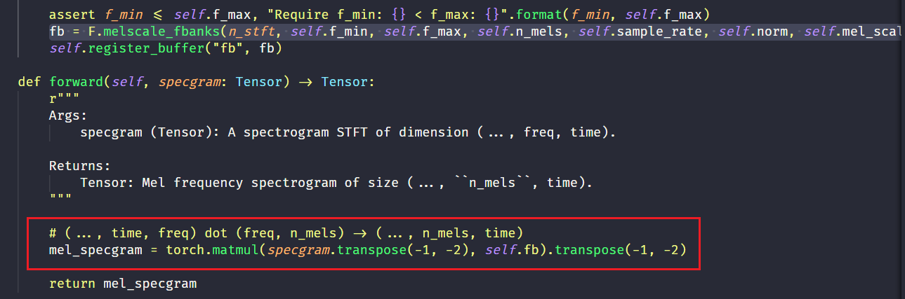
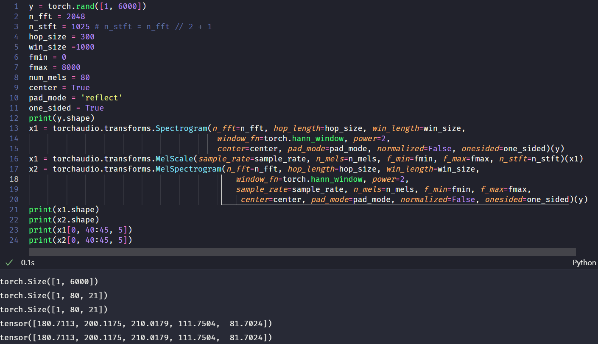
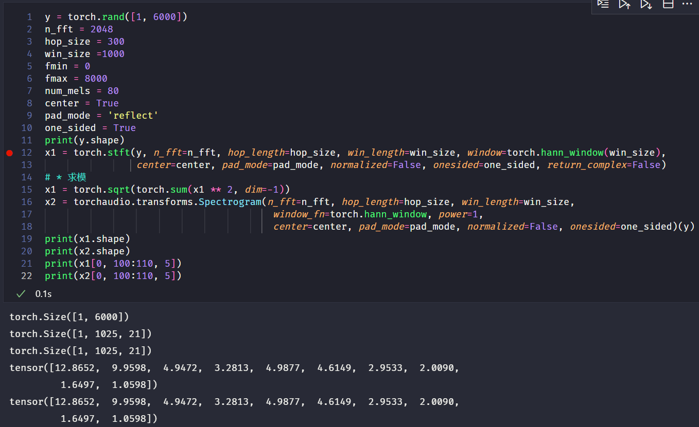
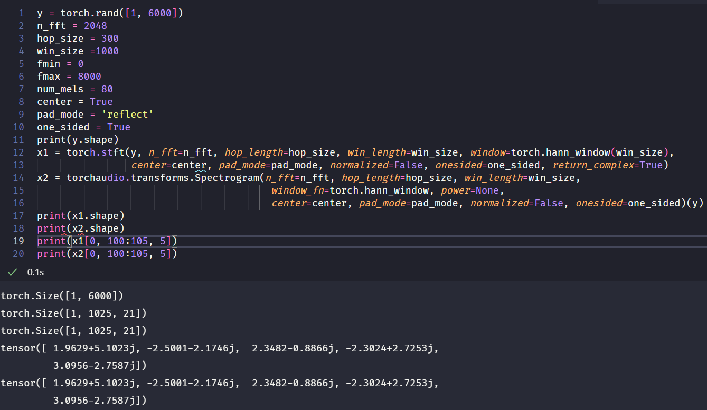
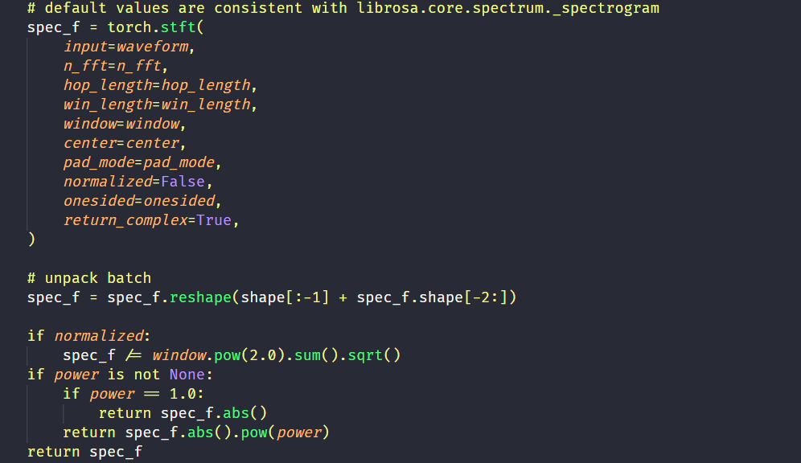

## torch 中的 stft、torchaudio 中的 Spectrogram、Melscale、MelSpectrogram 的使用

### torch.stft()

```python
output = torch.stft(input, n_fft, hop_length=None, win_length=None, window=None, center=True, pad_mode='reflect', normalized=False, onesided=None, return_complex=None)
```

*简介：短时傅里叶变换*

其中：

+ input(Tensor) 代表输入信号
+ n_fft(int) 代表快速傅里叶变换的序列长度
+ hop_length(int) 代表相邻两个滑动窗口帧之间的距离，也即是帧移
+ win_length(int) 代表窗口大小，默认等于 n_fft
+ window(Tensor) 代表窗口函数，默认是矩形窗口（全1）
+ center(bool) 代表是否对输入tensor在两端进行padding，使得第 $t$ 帧是以 $t \times hop\_length$ 为中心的，默认为 True，如果为 False，则第 $t$ 帧以 $t \times hop\_length$ 开始。
+ pad_mode(str) 代表padding的模式（当center为True才有效），默认为 reflect，即对边界的值进行reflect padding
+ normalized(bool) 代表是否对返回的STFT结果进行归一化，默认为 False
+ onesided(bool) 代表是否只返回一侧的STFT结果（当输入Tensor为实数时，输出为对称的），当输入Tensor和window都为实数时默认为 True，反之为 False
+ return_complex(bool) 代表返回实部和虚部的STFT结果还是返回复数

输出：
+ output(Tensor) 代表输出的STFT结果，维度为 $\star \times N \times T$，$\star$ 代表 batch size，$N$ 代表频率域的维度，$T$ 代表时间域的维度。

计算表达式为：

$$
X[\omega, m] = \sum_{k=0}^{\text {win\_length-1 }} \text { window }[k] \text { input }[m \times \text { hop\_length }+k] \exp \left(-j \frac{2 \pi \cdot \omega k}{\text { win\_length }}\right)
$$

其中，$m$ 为滑动窗口的索引，$\omega$ 代表频率，当 ``onesided=False`` 时，$\omega$ 的取值范围为：$[0, \text { n\_fft }]$，当 ``onesided=True`` 时，$\omega$ 的取值范围为：$[0, \lfloor \frac{\text { n\_fft} }2 \rfloor ]$

> 注意：上面的表达式是加窗的短时傅里叶变换，但是在计算过程中，往往采用快速傅里叶变换来计算每个 $m$ 对应的帧，因此 n_fft 和 win_length **可以不相等**，计算时对加窗后的信号进行补零到 n_fft 的长度，所以需要满足： 0 < win_length <= n_fft

> 当参数center默认为True时，此时会对信号进行padding，第 $0$ 帧以 $x[0]$ 居中，且左右两边 padding 的长度为 $\lfloor \frac{\text { n\_fft} }2 \rfloor$，输出的帧数为 $T = \lfloor \frac{\text{seq\_len}}{\text{hop\_length}}\rfloor + 1$ 其中，seq_len 代表输入tensor的序列长度。

> 而当设置center参数为False时，第 $0$ 帧以 $x[0]$ 为开头，输出维度很奇怪？？

> 在频域维度，当 ``oneside=True`` 输出的 $N = \frac{\text { n\_fft} }2 + 1 $ ，当 ``oneside=False`` 输出的 $N = \text { n\_fft}$

> 最后，由于此时并不知道输入信号的采样频率， 所以输出的频率没有具体值。或者说，输出矩阵在频率轴的值对应的频率为 $\omega = \frac{2\pi}{N}k$，其中，$k$ 为频率轴的索引，且这里的 $\omega$ 为DSP中常说的数字角频率，他和模拟频率 $f$ 的关系为：$\omega = \frac{2\pi f}{f_s}$，其中 $f_s$ 为输入信号的采样频率，那么 $k=\frac{\text{n\_fft}}{2}$ 为频率轴信号的最高频率（假定 ``oneside=True`` ），对应的具体值为采样率的 $1/2$，而这也符合奈奎斯特采样定理：
>
>> 为了不失真地恢复原始信号，采样率必须大于测量信号最大频率的两倍 $f_s > 2 \times f_N$
>>

### torchaudio.transforms.Spectrogram

```python
output = torchaudio.transforms.Spectrogram(n_fft: int = 400, win_length: Optional[int] = None, hop_length: Optional[int] = None, pad: int = 0, window_fn: Callable[[...], torch.Tensor] = <built-in method hann_window of type object>, power: Optional[float] = 2.0, normalized: bool = False, wkwargs: Optional[dict] = None, center: bool = True, pad_mode: str = 'reflect', onesided: bool = True, return_complex: Optional[bool] = None)
```
*简介：求输入信号的语谱图*

其中：
+ n_fft 为FFT的长度，默认为400，会生成 n_fft // 2 + 1 个 bins
+ win_length 为窗口的长度，默认为 n_fft
+ hop_length 为相邻两个滑动窗口帧之间的距离，即帧移，默认为 win_length // 2
+ pad 为对输入信号两边的补零长度，默认为 0
+ window_fn 为窗函数，默认为 torch.hann_window
+ power 为语谱图的幂指数，默认为 2.0，值必须大于 0，取 1 代表能量，取 2 代表功率。
+ normalized 为是否对语谱图进行归一化，默认为 False
+ wkwargs 为窗函数的参数，默认为 None
+ center 为是否对输入tensor在两端进行padding，使得第 $t$ 帧是以 $t \times hop\_length$ 为中心的，默认为 True，如果为 False，则第 $t$ 帧以 $t \times hop\_length$ 开始。
+ pad_mode 为补零方式，默认为 reflect
+ onesided 为是否只计算一侧的语谱图，默认为 True，即返回单侧的语谱图，如果为 False，则返回全部的语谱图。
+ return_complex 不再使用了

> 求解Spectrogram的本质其实还是stft，因此当 ```power=1```时，输出的就是stft的能量谱。当 ```power=None```时，就是直接输出了stft的结果，当```power=2```时，输出就是```power=1```的值的平方。

### torchaudio.transforms.MelScale
```python
torchaudio.transforms.MelScale(n_mels: int = 128, sample_rate: int = 16000, f_min: float = 0.0, f_max: Optional[float] = None, n_stft: Optional[int] = None, norm: Optional[str] = None, mel_scale: str = 'htk')
```
*简介：用来将stft的结果转换为mel域中的stft的结果。*

其中：
+ n_mels(int) 为mel滤波器的个数，默认为128
+ sample_rate(int) 为音频采样率，默认为16000
+ f_min(float) 为音频的最小频率，默认为0.0
+ f_max(float) 为音频的最大频率，默认为采样率二分之一： sample_rate // 2
+ n_stft(int) 为stft的bin的个数，不给的话默认为None，从第一个输入计算得到。
+ norm(str) 如果为“slaney”，则将三角形mel权重除以mel bin的宽度（即进行面积归一化），默认为None
+ mel_scale(str) 采用的mel尺度: htk 或者 slaney，默认 htk

输入：
+ input(Tensor) Spectrogram 的输出，其维度为 $\star \times n\_stft \times T$
输出：
+ output(Tensor) 返回大小为 $\star \times n\_mels \times T$ 的Tensor

> 这一过程其实就是首先计算一个 $\star \times n\_stft \times n\_mels$ 的滤波器组矩阵，这个矩阵体现了信号频率 和 mel 域频率之间的转换关系，然后和输入的 Spectrogram 做矩阵乘法：
> 最后求得mel域的Spectrogram，即Mel谱。

> 注意：计算Spectrogram的时候不需要采样率，这是因为输出的频率是数字域角频率，而在计算MelScale的时候，需要具体的模拟频率和Mel域频率之间的转换关系，因此需要采样率来求出模拟频率的具体值，最后再转换到Mel域频率。

### torchaudio.transforms.MelSpectrogram
```python
torchaudio.transforms.MelSpectrogram(sample_rate: int = 16000, n_fft: int = 400, win_length: Optional[int] = None, hop_length: Optional[int] = None, f_min: float = 0.0, f_max: Optional[float] = None, pad: int = 0, n_mels: int = 128, window_fn: Callable[[...], torch.Tensor] = <built-in method hann_window of type object>, power: float = 2.0, normalized: bool = False, wkwargs: Optional[dict] = None, center: bool = True, pad_mode: str = 'reflect', onesided: bool = True, norm: Optional[str] = None, mel_scale: str = 'htk')
```
*简介：求输入信号的Mel谱*

其中：
+ sample_rate(int) 为输入波形的采样率
+ n_fft(int) 为FFT的长度，默认为400，会生成 n_fft // 2 + 1 个 bins
+ win_length 为窗口的长度，默认为 n_fft
+ hop_length 为相邻两个滑动窗口帧之间的距离，即帧移，默认为 win_length // 2
+ f_min(float) 为音频的最小频率，默认为0.0
+ f_max(float) 为音频的最大频率，默认为None
+ pad 为对输入信号两边的补零长度，默认为 0
+ n_mels(int) 为mel滤波器的个数，默认为128
+ window_fn 为窗函数，默认为 torch.hann_window
+ power(float) 为语谱图的幂指数，默认为 2.0，值必须大于 0，取 1 代表能量，取 2 代表功率。
+ normalized(bool) 为是否对stft的输出进行归一化，默认为 False
+ wkwargs 为窗函数的参数，默认为 None
+ center(bool) 为是否对输入tensor在两端进行padding，使得第 $t$ 帧是以 $t \times hop\_length$ 为中心的，默认为 True，如果为 False，则第 $t$ 帧以 $t \times hop\_length$ 开始。
+ pad_mode(str) 为补零方式，默认为 reflect
+ onesided(bool) 为是否只计算一侧的谱图，默认为 True，即返回单侧的语谱图，如果为 False，则返回全部的谱图。
+ norm(str) 如果为“slaney”，则将三角形mel权重除以mel bin的宽度（即进行面积归一化），默认为None
+ mel_scale(str) 采用的mel尺度: htk 或者 slaney，默认 htk

输入：
+ input(Tensor) 输入波形信号

输出：
+ output(Tensor) 输出Mel谱

> 可以看出，MelSpectrogram的参数完全就是Spectrogram的参数+MelScale的参数。实际上，这个函数的计算过程就是在里面先计算spectrogram再计算mel_scale：
> 测试结果也验证了这一点：
> 用两种方法计算的mel谱结果完全一样。

### 其他
1. 关于信号的能量谱和功率谱（[参考](https://www.cnblogs.com/sccdlyc/archive/2012/08/13/2637121.html)）：
+ 能量谱：通常用来描述能量信号（能量有限的信号称为能量信号），表示的是信号在各个频点中的能量分布情况，如果对能量谱在频域进行积分，则可以求出信号的总能量。
+ 功率谱：通常用来描述功率信号（功率有限的信号称为功率信号），是指用密度的概念表示信号功率在各频率点的分布情况，对功率谱在频域上积分就可以得到信号的功率。
+ 维纳-辛钦定理：信号的功率谱和其自相关函数是一对傅里叶变换。在工程实际中，即便是功率信号，由于持续的时间有限，可以直接对信号进行傅里叶变换，然后对得到的幅度谱的模求平方，再除以持续时间来估计信号的功率谱。
+ 根据上面的解释，```torchaudio.transforms.Spectrogram``` 求功率谱时并没有除以持续时间，而是直接输出了平方值。

2. 关于Spectrogram和stft：
+ 当 ```torchaudio.transforms.Spectrogram``` 网络中的 ```power=1``` 时，输出的Spectrogram是能量图，在其他参数完全相同的情况下，其输出结果和 ```torch.stft``` 函数中 ```return_complex=True``` 的输出再求复数的模值之后的结果相同：
图中，$x_1$ 是stft函数求模之后的结果，$x_2$ 是直接求Spectrogram得到的结果。
+ 当 ```torchaudio.transforms.Spectrogram``` 网络中的 ```power=None``` 时，输出的Spectrogram是sftf的直接结果，在其他参数完全相同的情况下，其输出结果和 ```torch.stft``` 函数中 ```return_complex=True```  完全相同：
图中，$x_1$ 是stft函数之后的结果，$x_2$ 是直接求Spectrogram得到的结果。
+ 事实上，Spectrogram内部就是调用了stft的计算：
然后根据 ```power``` 取值计算最终的输出。

3. reflect padding : 以矩阵的边界为对称轴，将内部的数据复制到外部：
