## 定义

Wasserstein 距离是用于衡量两个分布之间的距离的一种度量方法。其起源是 最优传输问题 optimal transport problem，把概率分布想象成一堆石子，如何移动一堆石子，通过最小的累积移动距离把它堆成另外一个目标形状，这就是optimal transport所关心的问题，也成为 推土机距离 Earth-Mover (EM) distance

现在考虑一个简单的移动方盒的问题，如下图，假设有 6 个盒子，要把他们从左边实线的位置移动到虚线的位置，对于 位置 1 的 box，把一个盒子从位置 1 移动到位置 7，定义移动距离为位置之间的距离差，此时移动距离为 (7-1)=6，剩下两个位置 1 的盒子移动到位置 10，此时距离就是 2x9=18：
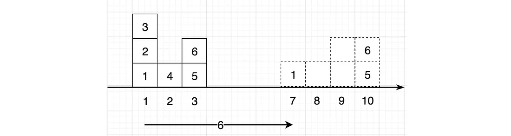

下图展示了两种不同的移动方案 $\gamma$，右边的表格表示了具体的移动方式：
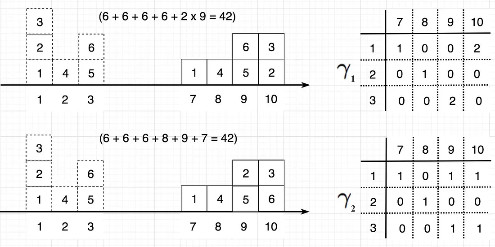
例如，在方案 1 中，把两个盒子从位置 1 移动到 位置 10，从而 $\gamma(1,10)$ 等于 $2$。

可以计算，上面的两种方法的总传输成本都是 42。

但是，并非所有的传输方案的成本都相同，而 Wasserstein 距离则定义为最优（低）的传输成本，如下图，这两种方案的成本不一致，而 Wasserstein 距离为 2：
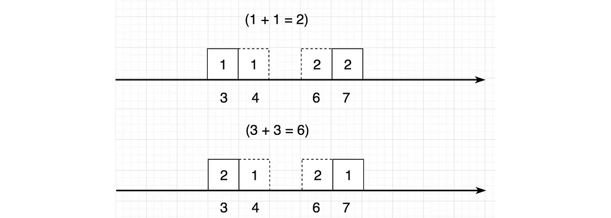

更专业来将，Wasserstein 为将分布从 $p$ 转移到分布 $q$ 的最优传输成本。

在 GAN 中，给定真实数据分布 $P_g$ 和 生成样本的分布 $P_r$，两个分布之间的 Wasserstein 距离为所有传输方案的成本的下确界（infimum）：
$$W(\mathbb{P}_r,\mathbb{P}_g)=\inf_{\gamma\in\Pi(\mathbb{P}_r,\mathbb{P}_g)}\mathbb{E}_{(x,y)\sim\gamma}\left[\parallel x-y\parallel\right]$$
在 WGAN 论文中，$\Pi(\mathbb{P}_r,\mathbb{P}_g)$ 表示所有的联合分布 $\gamma(x,y)$，且此分布的两个边缘分布分别是 $P_g$ 和 $P_r$。

具体到上面的例子，$\Pi$ 表示所有可能的传输方案：
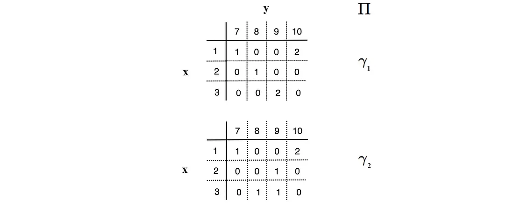
而所谓的边缘分布条件就是说，$\sum\gamma(^*,10)=2$，意思就是，从任何位置移动到 10 这个位置的总的盒子的个数为 2，这显然是很明显的。

## KL 散度和 JS 散度

KL 散度和 JS 散度分布定义为：
$$D_{KL}(P||Q)=\sum_{x=1}^{N}P(x)\log\frac{P(x)}{Q(x)}
,D_{JS}(p||q)=\frac{1}{2}D_{KL}(p||\frac{p+q}{2})+\frac{1}{2}D_{KL}(q||\frac{p+q}{2})$$

在 GAN 中，$p$ 为真实的数据分布，$q$ 为模型生成的数据分布。

假设 $p$ 为高斯分布，下面给出了真实的 $p$ 和一些不同的模型预测的 $q$ 分布：
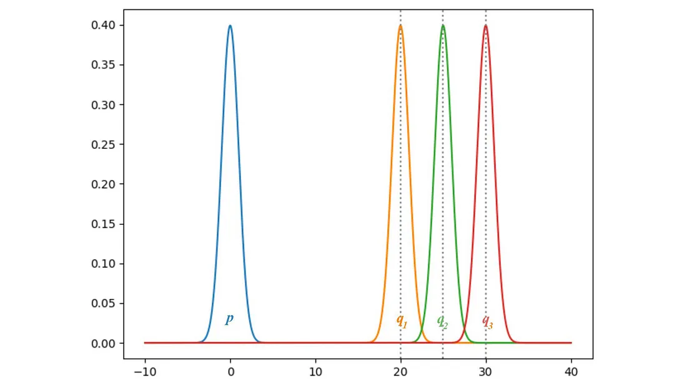

下图则画出了分布 $q$ 的均值从 0 到 35 之间变化时，KL 散度和 JS 散度的变化：
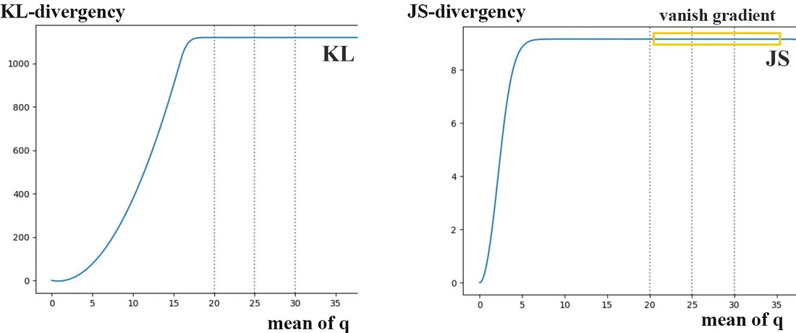
可以发现：
+ 当 $p$ 和 $q$ 相等时，两个散度都为 0
+ 随着 $q$ 的均值增加，散度增加，但是散度的梯度逐渐消失，趋近于 0

## Wasserstein 距离

但是呢，直接计算 Wasserstein 距离是不可行的，因为需要得到所有可能的传输方案，不过，采用 Kantorovich-Rubinstein duality，可以将其简化为：
$$W(\mathbb{P}_r,\mathbb{P}_\theta)=\sup_{\|f\|_L\leq1}\mathbb{E}_{x\sim\mathbb{P}_r}[f(x)]-\mathbb{E}_{x\sim\mathbb{P}_\theta}[f(x)]$$
其中的 $sup$ 是 least upper bound，而 $f$ 是 1-Lipschitz function。
> 1-Lipschitz function 即满足以下约束的函数：
> $$|f(x_1)-f(x_2)|\leq|x_1-x_2|$$

从而，计算 Wasserstein 距离，我们只需要找到一个 1-Lipschitz function。

那这里就可以用一个神经网络来建模这个函数，实际上这里的网络模型和 discriminator 很相似，除了输出不是 sigmoid 函数用来判断真假概率而是输出一个 标量 score。这个 score 可以表述为 how real the input images are。
> 强化学习中，通常称它为 value function。于是在这里将 discriminator 称为 critic。

总的来说，

GAN 可以表示为：
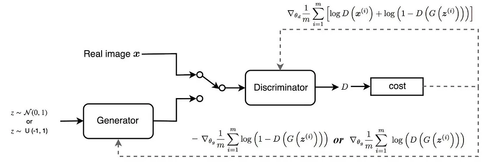

WGAN 则表示为：
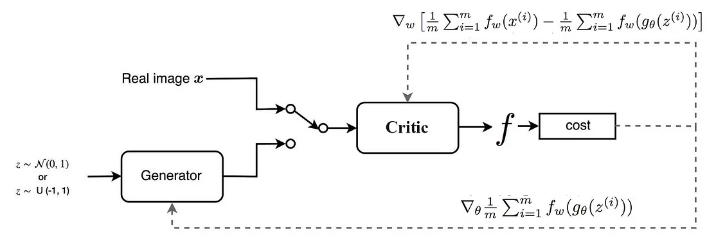

两者的区别在于损失函数：
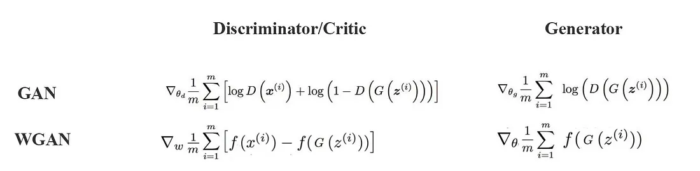

唯一的显示就是，函数 $f$ 为 1-Lipschitz function。实际操作的时候很简单，其实就是把 discriminator 的梯度的权重控制在一个范围内：
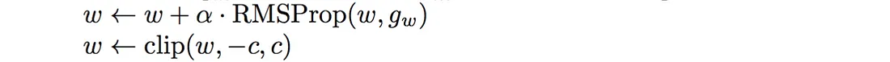

具体的算法的伪代码如下：
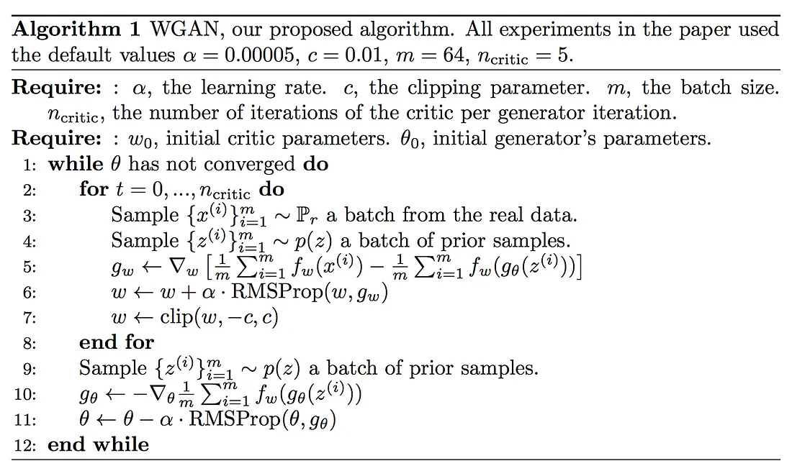