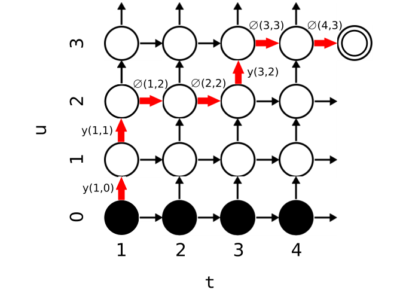
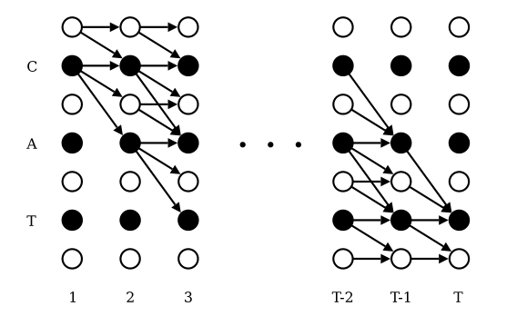
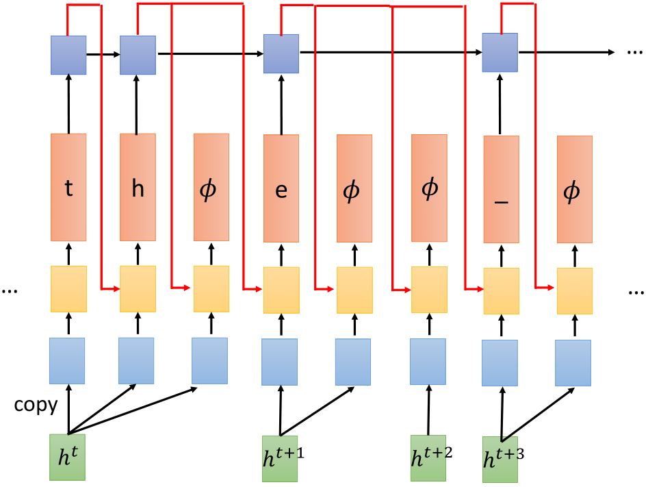

> 论文 - Sequence Transduction with Recurrent Neural Networks 笔记

1. RNN 常用来做序列建模，但是需要输入和输出序列对齐
2. 本文提出了基于RNN的端到端概率序列转换系统

### Introduction

1. 序列转换系统的一个主要问题就是对输入输出的鲁棒性
2. RNN 对长的可变序列的表征很强，但是也需要输入输出对齐
3. CTC 不适用于输出比输入还长的情况，且输出的label是离散的
4. 提出RNN-T，能够从原始数据中提取特征且可以提取无限制的依赖

### 模型

设 $\boldsymbol{x} = (x_1, x_2, \dots, x_T) \subset \mathcal{X}^* \in \mathcal{X}$ 表示长为 $T$ 的序列 $\boldsymbol{x}$ 属于集合 $\mathcal{X}^*$，集合位于输入空间 $ \mathcal{X}$，同理有长为 $U$ 的序列 $\boldsymbol{y} = (y_1, y_2, \dots, y_U) \subset \mathcal{Y}^* \in \mathcal{Y}$，定义拓展空间 $\bar{\mathcal{Y}}$ 为 $\mathcal{Y} \cup \varnothing$，其中 $\varnothing$ 代表 ”空“ 输出，且满足：$\left(y_{1}, \varnothing, \varnothing, y_{2}, \varnothing, y_{3}\right) \in \bar{\mathcal{Y}}^*$ 等效于 $\left(y_{1}, \varnothing, \varnothing, y_{2}, \varnothing, y_{3}\right) \in$。那么，给定输入 $\boldsymbol{x}$，RNN-T 定义了条件分布：$\operatorname{Pr}\left(\boldsymbol{a} \in \bar{\mathcal{Y}}^{*} \mid \boldsymbol{x}\right)$，其中 $\boldsymbol{a}$ 代表了一种对齐方式或者说，一条 **路径**（如 $\left(y_{1}, \varnothing, \varnothing, y_{2}, \varnothing, y_{3}\right)$ 就是一种）。那么输出 $\boldsymbol{y}$ 的条件概率为：

$$
\operatorname{Pr}\left(\boldsymbol{y} \in \mathcal{Y}^{*} \mid \boldsymbol{x}\right)=\sum_{\boldsymbol{a} \in \mathcal{B}^{-1}(\boldsymbol{y})} \operatorname{Pr}(\boldsymbol{a} \mid \boldsymbol{x})
$$

其中，$\mathcal{B}: \overline{\mathcal{Y}}^{*} \mapsto \mathcal{Y}^{*}$ 代表将所有的 ”空“ 标签从 $\overline{\mathcal{Y}}^{*}$ 的对齐中移除的操作。

> $\bar{\mathcal{Y}}^{*}$ 代表了包括 ”空“ 标签的所有可能对齐（路径）

RNN-T使用了两个RNN网络来求 $\operatorname{Pr}\left(\boldsymbol{a} \in \overline{\mathcal{Y}}^{*} \mid \boldsymbol{x}\right)$，其中一个网络为 transcription 网络 $\mathcal{F}$，扫描输入序列 $\boldsymbol{x}$ 输出转换序列 $\boldsymbol{f}=\left(f_{1}, \ldots, f_{T}\right)$，另一个网络为 prediction 网络 $\mathcal{G}$，扫描输出序列 $\boldsymbol{y}$ 输出预测序列 $\boldsymbol{g}=\left(g_{0}, g_{1}, \ldots, g_{U}\right)$

#### 预测网络

预测网络 $\mathcal{G}$ 的输入为 $\hat{\boldsymbol{y}}=\left(\varnothing, y_{1}, \ldots, y_{U}\right)$，设有 $K$ 个 label，$\boldsymbol{y}$ 为 one-hot 向量，输入 $\hat{\boldsymbol{y}}_{u}$ 为 $K$  维向量，则输出预测向量 $g_u$ 为 $K+1$ 维向量（包括一个 ”空“ 标签），该过程迭代如下：

$$
\begin{aligned}
h_{u} &=\mathcal{H}\left(W_{i h} \hat{\boldsymbol{y}}_{u}+W_{h h} h_{u-1}+b_{h}\right) \\
g_{u} &=W_{h o} h_{u}+b_{o}
\end{aligned}
$$

简单来说，预测网络就是给定前一个 $\hat{\boldsymbol{y}}_{u}$ 预测下一个 $\hat{\boldsymbol{y}}_{u+1}$，和传统的RNN一样，唯一的区别就是多了一个 “空” 输出。

#### 转换网络

转换网络 $\mathcal{F}$ 为 **双向** RNN，每一个输出都依赖于整个输出序列 $
\boldsymbol{x}$，则最终得到的转换序列为：

$$
\begin{aligned}
\overleftarrow{h}_{t}&=\mathcal{H}\left(W_{i \overleftarrow{h}} i_{t}+W_{\overleftarrow{h} \overleftarrow{h}} \overleftarrow{h}_{t+1}+b_{\overleftarrow{h}}\right) \\
\overrightarrow{h}_{t} &=\mathcal{H}\left(W_{i \overrightarrow{h}} i_{t}+W_{\overrightarrow{h} \overrightarrow{h}} \overrightarrow{h}_{t-1}+b_{ \overrightarrow{h}}\right) \\
o_{t} &=W_{\overrightarrow{h}_{o}} \overrightarrow{h}_{t}+W_{\overleftarrow{h} o} \overleftarrow{h}_{t}+b_{o}
\end{aligned}
$$

当label的数量为 $K$ 时，转换网络的输出为 $K+1$，最终转换向量 $f_t$ 的维度也是 $K+1$。

> 转换网络的其实和 CTC-RNN 相似。

#### 输出分布

给定转换网络的输出 $f_t, 1 \leq t \leq T$，预测网络的输出 $g_u, 1 \leq u \leq U$ 和标签 $k \in \bar{\mathcal{Y}}$，定义输出密度函数为：

$$
h(k, t, u)=\exp \left(f_{t}^{k}+g_{u}^{k}\right)
$$

上标 $k$ 表示输出向量的第 $k$ 个元素，那么最终的 **条件输出分布** 定义为：

$$
\operatorname{Pr}(k \in \bar{\mathcal{Y}} \mid t, u)=\frac{h(k, t, u)}{\sum_{k^{\prime} \in \bar{\mathcal{Y}}} h\left(k^{\prime}, t, u\right)}
$$

> 这里的 $k$ 代表的是向量中的某个元素，而 $\boldsymbol{y}$ 代表具体的某个label。

定义：

$$
\begin{aligned}
y(t, u) & \equiv \operatorname{Pr}\left(y_{u+1} \mid t, u\right) \\
\varnothing(t, u) & \equiv \operatorname{Pr}(\varnothing \mid t, u)
\end{aligned}
$$

$\operatorname{Pr}\left(k \mid t, u\right)$ 用于确定下图中格子的转换概率：

> 这张图中，红色代表一种可能的路径，我们的目的是从左下角走到右上角，向上走表示输出了一个非空标签 $y$，向右走表示输出了一个空标签 $\varnothing$。
> 图中最下面一行的黑色圆圈代表初始状态，和CTC的不同之处在于，这里是可以一次性先全部求出所有的 $f_t$（CTC每个 $f_t$ 对应输出一个 $y_t$，所以要求输入和输出的广义序列等长）：

> 回到本文RNN-T，由于一开始所有的 $f_t$ 就可以全部获得，那么我们在同一个时刻可以选择以下两种走法：
>
> + 输出好几个非空标签，也就是一直向上走
> + 输出好几个 ”空“标签，也就是一直向右走

> 一个更清晰的图：
> 图中，最下面一行代表输入 $\boldsymbol{x}$，黄色代表预测网络对应的RNN，下面的绿色色块代表转换网络的输出 $f_t$，上面其实还有一个RNN网络，但是没有在论文中重点说明，RNN-T 的核心就是橘黄色以下的部分。

> 基于上面的分析，要完成从左下角到右上角的路径，输出的 ”空“ 标签数量一定为 $T$

从图中的左下角到右上角的每条可行的路径组成的集合对应了 $\boldsymbol{x}$ 和 $\boldsymbol{y}$ 之间的所有对齐。那么所有可能的对齐（路径）的概率的求和就代表了，给定输入序列 $\boldsymbol{x}$，输出是 $\boldsymbol{y}$ 的概率。

> 1. 这里的 $\boldsymbol{y}$ 是去掉了 ”空“ 标签 $\varnothing$ 真实GT序列。
> 2. 并非所有的路径都能从 $\boldsymbol{x}$ 映射到 真实的 $\boldsymbol{y}$，所以我们最终的目的是，首先求出所有的可能路径，然后计算这些路径概率和 $\operatorname{Pr}(\boldsymbol{y} \mid \boldsymbol{x})$，最后最大化整个概率来训练整个模型。

> RNN-T 和 CTC 另一个最关键的区别在于，CTC的输出每个时刻都是独立的，和上一个时刻的输出无关，而RNN-T的输出和上一个时刻有关，是auto-regressive的。

那么难点在于，如何求出所有的可能路径，通常采用 forward-backward 前向后向算法来实现，这个时候，问题就简化成，给定某个真实标签（考虑语音识别，标签就变成字母，如 "i love you"），通过某种算法来实现从长为 $T$ 的序列到长为 $U$ 的序列的映射，使得映射后通过转换 $\mathcal{B}$ 能够得到真实文本（即 "i love you"）。

前向后向算法的简单思想就是，每次只考虑一个步，下一个step的所有可能路径是在当前step的所有路径中往后进行一步再剔除某些不正确的路径得到的，那么概率的计算在每个step只要进行一次就好了。动态规划思想使得我们不会在错误的路上一直走下去！
