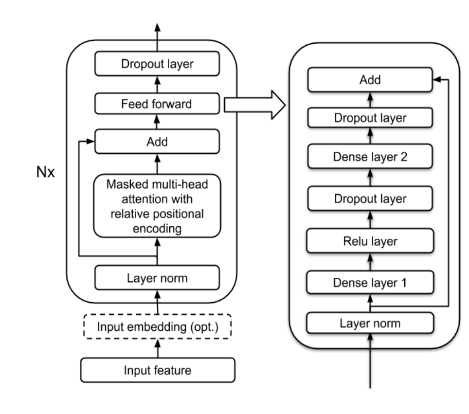
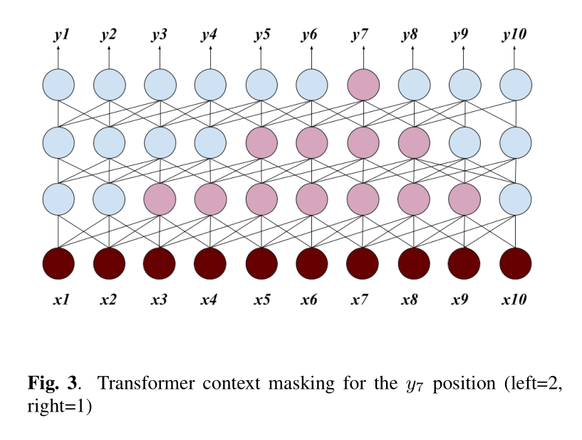

> 论文 - Transformer Transducer: A Streamable Speech Recognition Model with Transformer Encoders and RNN-T Loss
1. 基于Transformer Encoder，端到端ASR模型，采用了RNN-T损失函数。
2. Transformer 的注意力中，只考虑左边的上下文，以轻微的精度损失实现流式的ASR

## Introduction
1. Transformer 模型的解码需要encoder feature，所以难以进行流式
2. Transformer 的 attention 计算量大，耗时多，也难以实现流式，处理时间依赖于输入长度
3. RNN-T、RNA、Neural Transducer等基于RNN的流式模型采用的是编解码框架
4. 本文贡献：
    + 提出在传统的 [[RNN-T]] 结构中，用Transformer encoders替代基于RNN的encoders
    + 可以在固定数量的过去帧和标签下进行训练使其适用于流式
5. RNN-T 公式和变量定义：
    + 输入实值序列：$\mathbf{x} = (x_1, x_2, \dots, x_T)$ 
    + 目标标签序列：$\mathbf{y} = (y_1, y_2, \dots, y_U)$
    + 带 ”空“ 标签序列：其中，$\bar{U} = U + T$ 表示总长度（最后一个输出的是 $\varnothing$），$z_i, t_i$ 代表输出序列第 $t_i$ 个位置的值为 $z_i$。
    + 条件分布：$\mathbf{z}=\left[\left(z_{1}, t_{1}\right),\left(z_{2}, t_{2}\right), \dots,\left(z_{\bar{U}}, t_{\bar{U}}\right)\right]$
    + 总概率：$P(\mathbf{y} \mid \mathbf{x})=\sum_{\mathbf{z} \in \mathcal{Z}(\mathbf{y}, T)} P(\mathbf{z} \mid \mathbf{x})$，$\mathbf{z} \in  \mathcal{Z}(\mathbf{y}, T)$ 表示能将 $\mathbf{z}$ 转换成 $\mathbf{y}$ 的所有可能对齐。
 
## Transformer Transducer 结构
上述一个对齐 $P(\mathbf{z} \mid \mathbf{x})$ 的概率计算为：
$$
P(\mathbf{z} \mid \mathbf{x})=\prod_{i} P\left(z_{i} \mid \mathbf{x}, t_{i}, \operatorname{Labels}\left(z_{1:(i-1)}\right)\right)
$$
其中，$\operatorname{Labels}\left(z_{1:(i-1)}\right)$ 表示在 $z_{1:(i-1)}$ 中去掉非 ”空“ 标签后的序列。RNN-T使用 RNN 来建模求解这个概率，本文则将这个encoder替换为Transformer Encoder，模型的结构定义如下：
$$
\begin{aligned}
\text { Joint }= &\operatorname{Linear}\left(\text { AudioEncoder } t_{i}(\mathbf{x})\right)+ \\
&\text { Linear } \left.\left(\operatorname{LabelEncoder}\left(\operatorname{Labels}\left(z_{1:(i-1)}\right)\right)\right)\right) 
\end{aligned}
\\
\begin{aligned}
P\left(z_{i} \mid \mathbf{x}, t_{i}, \operatorname{Labels}\left(z_{1:(i-1))}\right)=\right. \\
\text { Softmax }(\operatorname{Linear}(\tanh (\text { Joint })))
\end{aligned}
$$

> 这里的 Audio Encoder 就相当于原始 RNN-T 论文里面的 Transcription Network，而 Label Encoder 就相当于原始 RNN-T 论文里面的 Prediction Network

### Transformer 

本文采用的 Transformer Encoder 的结构如图：

> 上述结构分别替换到 RNN-T 的 Audio Encoder 和 Label Encoder 中，且 Label Encoder不能注意到 Audio Encoder 的 attention 值，两个是独立的Transformer Encoder。
> 为了实现流式，可以固定一个窗口帧的大小，同时采用相对位置编码来避免重复计算

> 在 RNN-T 中，每次将一个input feature输入到RNN网络，然后会一直输出预测的标签直到输出的是 ”空“标签 $\varnothing$，此时再输入下一个input feature。

> 而在 Transformer-Transducer 中，每次输入的是一个窗口的input features，进行attention之后输出结果也会一直预测输出标签直到输出 ”空“标签 $\varnothing$

> 通过调整注意力机制的mask，可以实现不同速度下的流式识别：
> 图中 输出 $y_7$ 在每一层中都向前看一帧、向后看两帧，相比于原始的 Transformer 提高了计算效率。