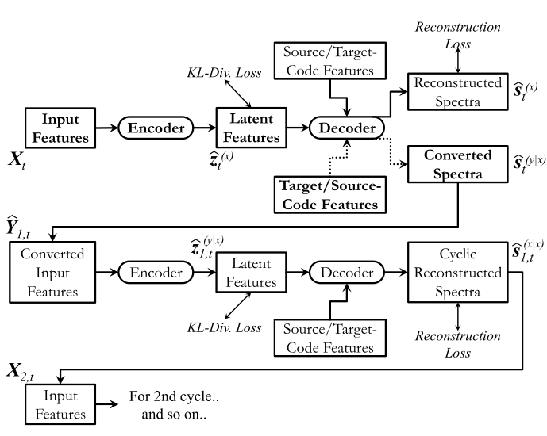

## Non-Parallel Voice Conversion with Cyclic Variational Autoencoder 笔记（2019年7月发表）

1. 本文贡献：提出了基于CycVAE的谱模型VC
2. we propose to use CycleVAE-based spectral model that indirectly optimizes the conversion flow by recycling the converted features back into the system to obtain corresponding cyclic reconstructed spectra that can be directly optimized

### Introduction

1. 近几年非并行数据SC常用方法：
   1. 聚类谱匹配
   2. RBM
   3. GAN-based
   4. VAE-based
2. VAE-based的优点：
   1. 隐空间建模能力
   2. 可通过各种神经网络结构实现（CNN、RNN等）
3. VAE的特点：
   1. speaker-coding的特征被添加到隐变量中用于解码
   2. 与源说话人相关的speaker-code被用于重构，与目标说话人相关的被用于转换
   3. 由于数据非并行，模型只能用于重构？
4. 本文:
   1. 使用循环一致映射流（cycle-consistent mapping flow）即CycVAE--based VC 进行间接优化
   2. 转换后的特征被反馈到系统中，产生相应的循环重构谱

### 原理

在CycVAE中，参数优化定义如下：

$$
\{\hat{{\theta}}, \hat{{\phi}}\}=\underset{{\theta}, {\phi}}{\operatorname{argmax}} \sum_{t=1}^{T} \mathcal{L}\left({\theta}, {\phi}, {X}_{t}, {c}^{(x)}, {c}^{(y)}\right)
$$

其中，$x, y$ 分别表示来自与源和目标说话人。且有：

$$
\begin{aligned}
&\mathcal{L}\left({\theta}, {\phi}, {X}_{t}, {c}^{(x)}, {c}^{(y)}\right)=\sum_{n=1}^{N}-D_{K L}\left(q_{\phi}\left({z}_{n, t} \mid {X}_{n, t}\right) \| p_{{\theta}}\left({z}_{t}\right)\right)\\
&-D_{K L}\left(q_{\phi}\left({z}_{n, t} \mid \hat{{Y}}_{n, t}\right) \| p_{{\theta}}\left({z}_{t}\right)\right)\\
&+\mathbb{E}_{q_{{\phi}\left({z}_{t} \mid {X}_{t}\right)}}\left[\log p_{{\theta}}\left({s}_{n, t}^{(x)}={s}_{t}^{(x)} \mid {z}_{n, t}, {c}^{(x)}\right)\right]\\
&+\mathbb{E}_{q_{\phi\left({z}_{t} \mid \hat{\mathbf{Y}}_{t}\right)}}\left[\log p_{{\theta}}\left({s}_{n, t}^{(x \mid x)}={s}_{t}^{(x)} \mid {z}_{n, t}, {c}^{(x)}\right)\right]
\end{aligned}
$$

其本质就是源说话人语音谱先通过一个VAE得到目标说话人对应的转换谱，然后将此转换谱再次通过VAE回到源说话人，在这个过程中进行优化求解参数。

CycVAE的输入和输出都是Mel谱，而不是语音波形，要输出语音波形，需要结合声码器Vocoder进行波形生成。

