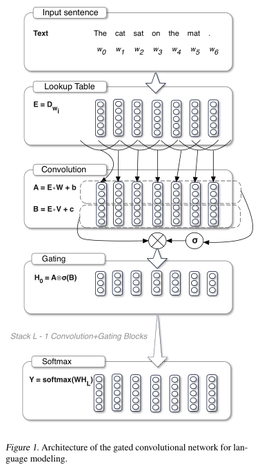

## Language Modeling with Gated Convolutional Networks 笔记

1. 使用非循环网络来进行语言建模，提出了一种门控CNN机制，效果优于pixelcnn

### Introduction

1. 统计语言模型采用概率来建模（n-gram）
2. 神经网络采用 LSTM 等来生成 word embedding
3. 本文提出了 gaated cnn 应用于语言模型，能够有更长期的依赖（long-term dependency），需要的运算更少，且更够并行运算，同时门控机制可以缓解深层网络的梯度消失问题。
4. 实验结果表明，效果优于LSTM，收敛也更快，并且在长依赖的文本中实现了SOTA

### 方法

记 $\mathbf{H}=[\mathbf{h}_0, \cdots, \mathbf{h}_N]$ 为待求解的word embedding，传统的 RNN 构建网络 $f$ 来循环计算：$\mathbf{h}_i = f(\mathbf{h}_{i-1}, w_{i-1})$ ，本文提出的方法则将输入和函数进行卷积：

$$
\mathbf{H} = f \ast g
$$

没有短时依赖，方便并行计算。模型结构如图
单词可以被看做是储存在 lookup table $\mathbf{D}^{|\mathcal{V}| \times e}$ 中的一系列词嵌入，其中 $|\mathcal{V}|$ 代表词表大小，$e$ 代表嵌入向量的维度。输入是词 $w_0, \cdots, w_N$ 对应的词嵌入向量 $\mathbf{E}=\left[\mathbf{D}_{w_{0}}, \ldots, \mathbf{D}_{w_{N}}\right]$，则隐藏层 $h_0, \cdots, h_L$ 计算如下：

$$
h_{l}(\mathbf{X})=(\mathbf{X} * \mathbf{W}+\mathbf{b}) \otimes \sigma(\mathbf{X} * \mathbf{V}+\mathbf{c})
$$

其中，$\mathbf{X}$ 为第 $h_l$ 层的输入，$\mathbf{W} \in \mathbb{R}^{k \times m \times n}, \mathbf{b} \in \mathbb{R}^{n}, \mathbf{V} \in \mathbb{R}^{k \times m \times n}, \mathbf{c} \in \mathbb{R}^n$ 为待学习的参数，$\sigma$ 为 sigmoid 函数，$\otimes$ 代表元素点积。
同时为了使得输出 $\mathbf{h}_i$ 不包含之前时刻的信息，对卷积输入进行移位。那么最终的结果为：

$$
\mathbf{H}=h_{L} \circ \ldots \circ h_{0}(\mathbf{E})
$$

### 其他

1. 在LSTM中还有forget gates，本文作者论证了不需要它也可以实现较好的结果。
2. 文中采用 adaptive softmax 来解决大词汇情况下的建模低效问题。
