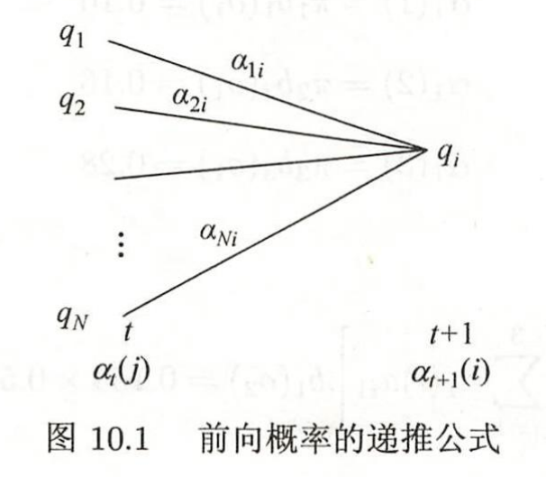

# HMM 笔记

## 定义

**隐马尔可夫模型 HMM** 的定义：
隐马尔可夫模型 是关于时序的概率模型，描述由一个隐藏的马尔可夫链随机生成不可预测的状态随机序列（状态序列），再由各个状态生成对应的观测从而产生观测随机序列（观测序列）的过程。

> 状态序列是不可观测的（这也是为什么被称为隐马尔可夫模型，而马尔可夫模型的状态序列是可以观测的），观测序列是状态序列对应生成的。**两者都是随机的**。
> 2023.12.1：其实就是，马尔可夫模型是直接状态之间的转移，然后得到的也是最终的状态，而 HMM 是通过状态之间的转移，得到状态之后，每个状态又会根据一定的概率来得到一个最终的观测序列，且只有这个观测序列是已知的，中间的状态序列不知道。（其实就是多了一个观测概率 $B$）

**隐马尔可夫模型 HMM** 的数学定义：
设 $Q$ 是所有可能的状态的集合，$V$ 是所有可能的观测的集合：

$$
Q=\left\{q_{1}, q_{2}, \cdots, q_{N}\right\}, \quad V=\left\{v_{1}, v_{2}, \cdots, v_{M}\right\}
$$

其中，$N$ 是可能的状态数，$M$ 是可能的观测数。

那么对于某个特定的系统，设 $I$ 为长度为 $T$ 的状态序列，$O$ 为对应的观测序列：

$$
I=\left\{i_{1}, i_{2}, \cdots, i_{T}\right\}, \quad O=\left\{o_{1}, o_{2}, \cdots, o_{T}\right\}
$$

其中，$i_t \in Q, o_t \in V$。

定义状态转移矩阵 $A = [a_{ij}]_{N\times N}$，其中

$$
a_{i j}=P\left(i_{t+1}=q_{j} \mid i_{t}=q_{i}\right), \quad i=1,2, \cdots, N ; \quad j=1,2, \cdots, N
$$

代表在时刻 $t$ 处于状态 $q_i$ 的条件下在时刻 $t+1$ 转移至状态 $q_j$ 的概率。

定义观测概率矩阵 $B = [b_{j}(k)]_{N\times M}$，其中

$$
b_{j}(k)=P\left(o_{t}=v_{k} \mid i_{t}=q_{j}\right), \quad k=1,2, \cdots, M ; \quad j=1,2, \cdots, N
$$

代表在时刻 $t$ 处于状态 $q_j$ 的条件下观测到 $v_k$ 的概率。

> $A$ 是一个方阵，表示的是前后两个时刻（因为马尔可夫的性质，我们只需关注前一时刻就可以）之间的状态转换概率；$B$ 表示的是同一个时刻下某个状态对应的输出哪个观测值的概率。

设系统的初始状态概率向量为 $\pi = (\pi_i)$，其中 $\pi_i = P(i_1 = q_i)$ 表示在时刻 $1$ 处于状态 $q_i$ 的概率。

> 说明，初始是哪个状态也可能是未知的。

则 HMM 模型 $\lambda$ 可以用上述三元符号表示：

$$
\lambda = \left(A, B, \pi\right)
$$

> 隐马尔可夫模型具有观测独立性，即任意时刻的观测只依赖于该时刻HMM的状态，而和其他时刻的状态、其他时刻的观测无关：
>
> $$
> P\left(o_{t} \mid i_{T}, o_{T}, i_{T-1}, o_{T-1}, \cdots, i_{t+1}, o_{t+1}, i_{t}, i_{t-1}, o_{t-1}, \cdots, i_{1}, o_{1}\right)=P\left(o_{t} \mid i_{t}\right)
> $$

> 状态是指一个事件或系统当前的某个确定的情况，比如说，拿考试这件事来说，假设我只能考三种分数，分别是0、60、100分，对应了该事件下的三个状态（$N=3$）。而观测序列是在**状态转移时**伴随的输出，还是拿考试来举例子，根据上一次考的分数和这一次考试的分数（即形成了状态转移），可能存在以下几种不同的情况（$M=5$）：
>
> + 无事发生
> + 奖励100元
> + 奖励200元
> + 挨骂半小时
> + 挨骂一小时
>
> 那么，状态转移矩阵就体现了每次考试的分数变化的概率，例如，第一次考60分，那么第二次还考60分的概率为0.6，第二次考100分的概率为0.3，第二次考0分的概率为0.1，按这种方式，最终可以得到一个 $3\times 3$ 的状态转移矩阵：
>
> $$
 \begin{bmatrix}
  0.6 & 0.35 & 0.05\\
 0.1 & 0.6 & 0.3 \\  
 0.05 & 0.4 & 0.55
 \end{bmatrix}
 $$
>
> 同时，根据不同的状态，回家见家长之后可能会存在不同的结果，也就是前面说的观测值，例如，如果第一次考60，第二次考100，那么*无事发生*的概率为0.05，*奖励100元*的概率为0.75，*奖励200元*的概率为0.2，*挨骂半小时*的概率为0，*挨骂一小时*的概率为0；而如果第一次考60分，第二次考0分，那么*无事发生*的概率为0.01，*奖励100元*的概率为0，*奖励200元*的概率为0，*挨骂半小时*的概率为0.79，*挨骂一小时*的概率为0.2，按照这种方式，我们也可以得到一个 $5\times 5$ 的状态转移矩阵。
>

## 序列生成

输入：HMM 模型 $\lambda = (A,B,\pi)$，序列长度 $T$

输出：观测序列 $O = (o_{1}, o_{2}, \cdots, o_{T})$

生成过程：

1. 按照初始状态分布 $\pi$ 产生状态 $i_{1}$;
2. 令 $t=1$;
3. 按照状态 $i_{t}$ 的观测概率分布 $b_{i_{t}}(k)$ 生成 $o_{t}$;
4. 按照状态 $i_{t}$ 的状态转移概率分布 $\left\{a_{i_{t} i_{t+1}}\right\}$ 产生状态 $i_{t+1}, i_{t+1}=1,2, \cdots, N$;
5. 令 $t=t+1$; 如果 $t<T$, 转步骤 3; 否则, 终止。

## 三个基本问题

1. 概率计算：给定 $\lambda$ 和 $O$，计算观测到 $O$ 的概率 $P(O \mid \lambda)$ 有多少。
2. 参数学习：给定已知的观测序列 $O$，估计模型的参数 $\lambda$，使得该参数定义下的模型预测观测序列概率 $P(O \mid \lambda)$ 最大，即最大似然估计。
3. 状态预测（解码过程）：已知模型的参数 $\lambda$ 和观测序列 $O =  (o_{1}, o_{2}, \cdots, o_{T})$，求出能够使得观测序列条件概率最大的状态序列 $I = (i_{1}, i_{2}, \cdots, i_{T})$。也就是在某个观测序列已知的情况下求最有可能输出这个观测序列的状态序列。

### 前向后向算法——概率计算

**目的：计算 $P(O \mid \lambda)$**

#### 直接计算法（暴力求解）

给定了 $\lambda = (A,B,\pi)$ 和 观测序列 $O = (o_1, o_2, \dots, o_T)$，直接列举出所有可能的状态序列，然后计算状态序列和观测序列的联合概率 $P(O,I \mid \lambda)$，再对所以可能的状态得到的联合概率求和（相当于对状态进行积分）得到 $P(O \mid \lambda)$。

首先，对某个状态序列，他出现的概率为：

$$
P(I \mid \lambda)=\pi_{i_{1}} a_{i_{1} i_{2}} a_{i_{2} i_{3}} \cdots a_{i_{T-1} i_{T}}
$$

在该状态下，输出此观测序列的概率为：

$$
P(O \mid I, \lambda)=b_{i_{1}}\left(o_{1}\right) b_{i_{2}}\left(o_{2}\right) \cdots b_{i_{T}}\left(o_{T}\right)
$$

联合概率为：

$$
\begin{aligned}
P(O, I \mid \lambda) &=P(O \mid I, \lambda) P(I \mid \lambda) \\
&=\pi_{i_{1}} b_{i_{1}}\left(o_{1}\right) a_{i_{1} i_{2}} b_{i_{2}}\left(o_{2}\right) \cdots a_{i_{T-1} i_{T}} b_{i_{T}}\left(o_{T}\right)
\end{aligned}
$$

把所有的可能的状态对应的联合概率加起来，总概率为：

$$
\begin{aligned}
P(O \mid \lambda) &=\sum_{I} P(O \mid I, \lambda) P(I \mid \lambda) \\
&=\sum_{i_{1}, i_{2}, \cdots, i_{T}} \pi_{i_{1}} b_{i_{1}}\left(o_{1}\right) a_{i_{1} i_{2}} b_{i_{2}}\left(o_{2}\right) \cdots a_{i_{T-1} i_{T}} b_{i_{T}}\left(o_{T}\right)
\end{aligned}
$$

这个方法的计算量是 $TN^T$ 阶，显然太大了。

> $TN^T$ 的来源：首先找到所有可能的状态序列，这个过程的复杂度为 $N^T$，因为对于每个时刻，都有 $N$ 种状态，一共 $T$ 时刻，排列组合一共有 $N^T$ 的种可能性。计算每个状态的概率又有 $T$ 次乘法，所以才算到这个复杂度。

#### 前向-后向算法（forward-backward algorithm）
首先定义前向概率为，直到时刻 $t$ 的“部分观测序列”为 $o_1, o_2, \cdots, o_t$，且在时刻 $t$ 的状态为 $q_i$ 的联合概率：
$$
\alpha_{t}(i)=P\left(o_{1}, o_{2}, \cdots, o_{t}, i_{t}=q_{i} \mid \lambda\right)
$$

>  $\pi_i = P(i_1 = q_i)$ 表示在时刻 $1$ 处于状态 $q_i$ 的概率，$b_i(o_1)$ 表示时刻 $1$ 下转移至状态 $q_i$ 的观测输出为 $o_1$ 的概率

则HMM的前向算法计算如下：
1. 初值：$\alpha_{t}(i)=P\left(o_{1}, o_{2}, \cdots, o_{t}, i_{t}=q_{i} \mid \lambda\right)$
2. 递推式：对 $t=1,2,\cdots, T-1$，有：
$$
\alpha_{t+1}(i)=\left[\sum_{j=1}^{N} \alpha_{t}(j) a_{j i}\right] b_{i}\left(o_{t+1}\right), \quad i=1,2, \cdots, N
$$
> 下一个时刻的概率，等于前一个时刻的能到当前时刻的状态乘以对应得转移概率求和，再乘以下一个时刻转移至状态 $q_i$ 的观测输出为 $o_{t+1}$ 的概率，如图：
3. 上述可以求出直到最后一个时刻 $T$ 下所有的状态的前向概率，则最终的联合概率为：
$$
P(O \mid \lambda)=\sum_{i=1}^{N} \alpha_{T}(i)
$$

> 之所以前向算法可以快速计算联合概率，是因为每次计算都用上了前一次的计算结果，算下来每个概率只要计算一次就可以了，这样子复杂度可以降低到 $O(TN^2)$。

同理，后向算法为从观测到的最后时刻 $T$ 的观测值往前推。定义后向概率如下：
$$
\beta_{t}(i)=P\left(o_{t+1}, o_{t+2}, \cdots, o_{T} \mid i_{t}=q_{i}, \lambda\right)
$$
递推公式为：
$$
\beta_{t}(i)=\sum_{j=1}^{N} a_{i j} b_{j}\left(o_{t+1}\right) \beta_{t+1}(j), \quad i=1,2, \cdots, N
$$
最后也可以计算总的联合概率：
$$
P(O \mid \lambda)=\sum_{i=1}^{N} \pi_{i} b_{i}\left(o_{1}\right) \beta_{1}(i)
$$

### Baum-Welch 算法——参数学习
目标： 最大似然法预测模型参数 $\lambda$。

#### 监督学习方法
训练数据为 $S$ 个长度相同的观测序列和对应的状态序列：$\{(O_1,I_1), (O_2, I_2), (O_S, I_S)\}$，使用最大似然法预测模型参数 $\lambda=(A,B,\pi)$ 如下：
1. 由于已经有了大量的训练样本，那么估计转移概率矩阵 $A$ 中的元素 $a_{ij}$ 可以用频数代替频率。假设 $S 个样本中，由时刻 $t$ 处于状态 $q_i$ 转移到时刻 $t+1$ 处于状态 $q_{j}$ 的频数为 $A_{i,j}$，那么估计量 $\hat{a}_{ij}$ 为：
$$
\hat{a}_{i j}=\frac{A_{i j}}{\sum_{j=1}^{N} A_{i j}}, \quad i=1,2, \cdots, N ; \quad j=1,2, \cdots, N
$$
2. 同理可以估计观测概率矩阵。设样本中当状态为 $j$ 时观测值为 $k$ 频数为 $B_{jk}$，那么观测矩阵的估计量 $\hat{b}_{j}(k)$ 为：
$$
\hat{b}_{j}(k)=\frac{B_{j k}}{\sum_{k=1}^{M} B_{j k}}, \quad j=1,2, \cdots, N ; \quad k=1,2, \cdots, M
$$

#### 无监督学习方法
监督学习算法需要已知状态序列，然而实际应用中很难得到状态序列，通常只有 $S$ 个长度相同的观测序列，为了学习到相应的参数 $\lambda=(A,B,\pi)$，将观测序列看成观测数据 $O$，状态序列看成隐变量 $I$，则：
$$
P(O \mid \lambda) =\sum_{I} P(O \mid I, \lambda) P(I \mid \lambda)
$$
可以通过EM算法实现参数估计。

##### EM算法
这一节和前面的没有关系，只是简单介绍了EM算法的原理。

EM算法适用于抽取的样本**来源**未知时，对每个分布进行参数估计 的情况。
举一个网上最常举的例子，假设从学校随机抽取了200个人，想估计学校中男生和女生的身高，记这组数据为 $X=(x_1, x_2, \dots, x_{200})$，随机抽取的过程中并不知道获得的数据是男还女，这里男/女就是隐变量，或者说隐状态，而最终得到的200个样本数据就是观测数据。

那么为了估计男女身高的参数值，我们首先随机初始化一个数（假设身高分布服从高斯分布），例如男生身高 $\mu_b = 1.7$，女生身高 $\mu_g = 1.6$（这里假设方差 $\sigma^2=0.0025$ 已知），那么首先根据这个假设的参数，我们可以分别求出样本属于男生和女生的概率。

> 这里貌似要假设所有类别出现的概率相等，也就是说隐状态出现的概率相等。

> 这里存在一个问题，求出的概率之后是否要进行二元划分，即如果是男生的概率 0.7 大于是女生的概率 0.3，则认定此人为男生，反之相反。这种做法不太好，一方面它丢弃了这个过程中计算的概率值（而是以0\1替代），另一方面只适用于二元的情况，而且当概率相等的时候也不好解释。所以通常是认为，此人有 70% 的概率是男生，30% 概率是女生。

比如说，第一个人身高是 $x_1 = 1.72$，那么他是男生和女生的概率计算如下：

$$P_b(x_1) = \frac{f_b(x_1)}{f_b(x_1)+f_g(x_1)} = 94.3\%, \quad P_g(x_1) = \frac{f_g(x_1)}{f_b(x_1)+f_g(x_1)} = 5.7\%$$

求出了第一个人是男\女的（状态）概率后，依次可以求出后面200个人的概率，我们分别以 $\{P_b(x_1), P_g(x_1)\}, \{P_b(x_2), P_g(x_2)\}, \dots, \{P_b(x_{200}), P_g(x_{200})\}$，这一过程为EM算法的E步（期望计算步）。

然后进行最大似然求解，即EM算法的M步，也就是重新估计一组参数能够使得在给定上述每个样本的类别概率（隐状态概率）下，能够使得不同的状态对应的分布似然最大的一组参数（即重新更新男生和女生身高的高斯分布的均值）：
$$
\begin{align*}
\mu_b &= \sum_{i=1}^{200} P_b(x_i) x_i \\
\mu_g &= \sum_{i=1}^{200} P_g(x_i) x_i
\end{align*}
$$

依次迭代即可分别求出男生和女生的身高的均值。

> 简单来说，E 步假设参数已知来进行重新分类，M 步根据E步的分类结果，结合最大似然法更新参数

上述只是简单的描述了EM算法的基本原理，下面从公式开始推导。首先假设观测的样本数据为 $X=(x_1, x_2, \dots, x_{R})$ 共 $R$ 个样本，每个样本对应的隐状态（或者说所属的类别）记为 $Z = (z_1, z_2, \dots, z_{R})$，关于所有样本的对数似然 $\sum_{i} \log p\left(x^{(i)} ; \theta\right)$ 为：
$$
\begin{aligned}
\sum_{i=1}^{R} \log \sum_{z_{i}} p\left(x_{i}, z_{i} ; \theta\right) &=\sum_{i=1}^{R} \log \sum_{z_{i}} Q_{i}\left(z_{i}\right) \frac{p\left(x_{i}, z_{i} ; \theta\right)}{Q_{i}\left(z_{i}\right)} \\
& \geq \sum_{i=1}^{R} \sum_{z_{i}} Q_{i}\left(z_{i}\right) \log \frac{p\left(x_{i}, z_{i} ; \theta\right)}{Q_{i}\left(z_{i}\right)}
\end{aligned}
$$

> 这里引入了一个新的分布 $Q_i(z_i)$；
> 不等式缩放是根据 Jessen 不等式：$E[f(X)] \leq f(E[X])$，成立的前提是 $f(\cdot)$ 是凹函数，当为凸函数时不等号反向。

我们这里首先假设参数 $\theta$ 是固定的，那么当上述不等式取等号的时候，最大似然就变成了求不等号右边的，由 Jessen 不等式的性质，当
$$
\frac{p\left(x_{i}, z_{i} ; \theta\right)}{Q_{i}\left(z_{i}\right)}={c}, {c} \text { 为常数 }
$$
时取等号。此外，由于 $Q_i(z_i)$ 是一个分布，满足 $\sum_{z} Q_{i}\left(z_{i}\right)=1$，则 $\sum_{z} p\left(x_{i}, z_{i} ; \theta\right)=c$，即：
$$
Q_{i}\left(z_{i}\right)=\frac{p\left(x_{i}, z_{i} ; \theta\right)}{\sum_{z} p\left(x_{i}, z_{i} ; \theta\right)}=\frac{p\left(x_{i}, z_{i} ; \theta\right)}{p\left(x_{i} ; \theta\right)}=p\left(z_{i} \mid x_{i} ; \theta\right)
$$
这说明，在固定了 $\theta$ 之后，我们可以通过求后验概率 $p\left(z_{i} \mid x_{i} ; \theta\right)$ 来得到 $Q_i(z_i)$，这一过程就是 EM 算法的 E 步；

> 回到上面的例子，这里的后验概率 $p\left(z_{i} \mid x_{i} ; \theta\right)$ 就是我们求一个样本它来自于男生和女生的概率。

通过上式确定了 $Q_i(z_i)$ 就可以确保等号的成立，那么最终我们的目标是最大似然函数，也就是求参数 $\theta$ 来最大化下式：
$$
\hat{\theta} = \arg\max \limits_\theta \sum_{i=1}^{R} \sum_{z_{i}} Q_{i}\left(z_{i}\right) \log \frac{p\left(x_{i}, z_{i} ; \theta\right)}{Q_{i}\left(z_{i}\right)}
$$
这个过程顾名思义也就是 EM 算法的 M 步。

> 为什么 EM 算法可行：一个直观的理解就是，EM 算法每次都会基于模型参数计算一个分布，使得利用此分布计算得到的似然函数值为函数的下界，然后再基于此分布通过最大似然法来更新参数，更新参数之后的最大似然相比于之前的值变大了，此时基于此参数又计算一个新的分布，重复该过程即可一步一步最大化似然函数的下界，也就是变相求解了最大似然。

##### EM 算法求解 HMM 模型参数
首先再次明确目标：在状态序列 $I$ 未知、观测序列 $O$ 已知的情况下，求 $\lambda = (A,B,\pi)$ 来最大化似然函数 $P(O \mid \lambda)$。

虽然状态序列未知，这里还是需要定义隐状态序列 $I = (i_1, i_2, \dots, i_T)$， 观测序列为 $O = (o_1, o_2, \dots, o_T)$，包含隐状态的对数似然为 $\log P(O, I \mid \lambda)$，则 EM 算法求解 HMM 模型的参数步骤为：
> 这个有点类似于，已知 $P(x \mid \theta)$ 来求解 $\theta$ 使得似然函数最大。

+ E 步：求 $Q$ 函数 $Q(\lambda, \bar{\lambda})$：$$
    Q(\lambda, \bar{\lambda})=\sum_{I} \log P(O, I \mid \lambda) P(O, I \mid \bar{\lambda})
    $$其中，$\bar{\lambda}$ 是模型参数在该迭代步的估计值，$\lambda$ 是要最大化的 HMM 模型参数，由于：$$
    P(O, I \mid \lambda)=\pi_{i_{1}} b_{i_{1}}\left(o_{1}\right) a_{i_{1} i_{2}} b_{i_{2}}\left(o_{2}\right) \cdots a_{i_{T-1} i_{T}} b_{i_{T}}\left(o_{T}\right)
    $$于是 $Q$ 函数可以写成：$$\begin{aligned}
Q(\lambda, \bar{\lambda})=& \sum_I \log \pi_{i_1} P(O, I \mid \bar{\lambda})+\sum_I\left(\sum_{t=1}^{T-1} \log a_{i_t i_{t+1}}\right) P(O, I \mid \bar{\lambda})+\\
\sum_I\left(\sum_{t=1}^T \log b_{i_t}\left(o_t\right)\right) P(O, I \mid \bar{\lambda})
\end{aligned}$$式中求和都是对序列总长度 $T$ 进行的。
+  M 步：通过最大化 $Q$ 函数 $Q(\lambda, \bar{\lambda})$ 求解模型参数 $A,B,\pi$，由于需要最大化的三个参数分别存在于 $Q$ 函数的三个项中，因此独立最大化每个项即可得到每个参数的值。
	+ 求解 $\pi$，第一项可以写成 $$\sum_I \log \pi_{i_1} P(O, I \mid \bar{\lambda})=\sum_{i=1}^N \log \pi_i P\left(O, i_1=i \mid \bar{\lambda}\right)$$求偏导然后令其为零，得到 $$\pi_i=\frac{P\left(O, i_1=i \mid \bar{\lambda}\right)}{P(O \mid \bar{\lambda})}$$
	+ 求解 $A$ ，第二项可以写为$$\sum_I\left(\sum_{t=1}^{T-1} \log a_{i_t i_{t+1}}\right) P(O, I \mid \bar{\lambda})=\sum_{i=1}^N \sum_{j=1}^N \sum_{t=1}^{T-1} \log a_{i j} P\left(O, i_t=i, i_{t+1}=j \mid \bar{\lambda}\right)$$同理，有 $$a_{i j}=\frac{\sum_{t=1}^{T-1} P\left(O, i_t=i, i_{t+1}=j \mid \bar{\lambda}\right)}{\sum_{t=1}^{T-1} P\left(O, i_t=i \mid \bar{\lambda}\right)}$$
	+ 求解 $B$，第三项可以写为$$\sum_I\left(\sum_{t=1}^T \log b_{i_t}\left(o_t\right)\right) P(O, I \mid \bar{\lambda})=\sum_{j=1}^N \sum_{t=1}^T \log b_j\left(o_t\right) P\left(O, i_t=j \mid \bar{\lambda}\right)$$从而，$$b_j(k)=\frac{\sum_{t=1}^T P\left(O, i_t=j \mid \bar{\lambda}\right) I\left(o_t=v_k\right)}{\sum_{t=1}^T P\left(O, i_t=j \mid \bar{\lambda}\right)}$$

### 维特比算法——状态预测
