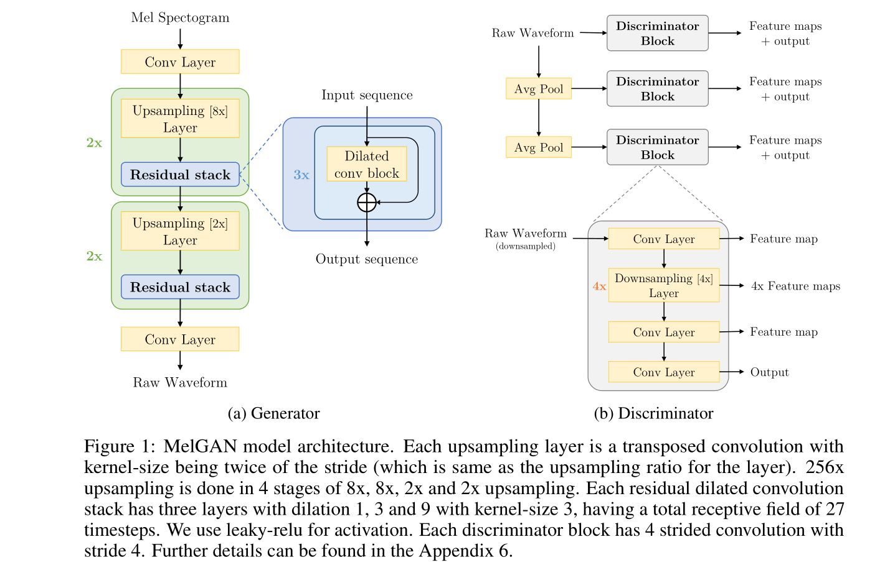
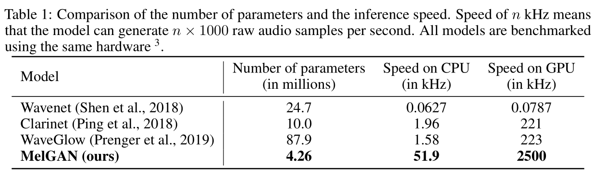

<!--
 * @Description: 
 * @Autor: 郭印林
 * @Date: 2022-08-16 17:48:28
 * @LastEditors: 郭印林
 * @LastEditTime: 2022-08-16 18:46:03
-->

## MelGAN: Generative Adversarial Networks for Conditional Waveform Synthesis 笔记

1. 训练GAN来产生高质量的连续音频
2. MelGAN：非自回归、全卷积、参数更少、对集外谱的转换效果更好

### Introduction

1. 由Mel谱转音频有三个方法：
   + 纯DSP技术：Griffin-Lim、WORLD vocoder，缺点是人工痕迹严重
   + 自回归：WaveNet、SampleRNN、WaveRNN，缺点是不适用于实时应用
   + 非自回归神经网络：Parallel Wavenet、WaveGlow、
2. 本文贡献：
   + 第一个将 GAN 成功用在波形生成中，且不需要额外的损失
   + 验证了采用 Parallel MelGAN 可以替代自回归模型以实现快速、并行的波形生成
   + Mel GAN 比当时最快的模型要快10倍

### Mel GAN 模型原理
Mel GAN模型结果如图所示：

#### 生成器 

##### 结构
生成器为全卷积网络，输入为Mel谱 $s$，输出为波形 $x$。通过层叠转置卷积进行上采样，每层转置卷积后面都跟一层带有空洞卷积的残差网络。且输入噪声对输出波形影响不大。同时从 $s \to x$ 的映射是一对多的，因为 $s$ 是 $x$ 的有损压缩。

##### 诱导感受野
由于诱导感受野之间的重叠，使得空间上相邻的像素相互关联。因此在每个上采样层之后添加了带dilation的残差模块，提高感受野的范围，产生更远的相关性。

##### 棋盘效应
当转置卷积的 kernel size 和 stride 选的不对的时候，可能出现棋盘效应，使得输出音频有高频的嘶嘶噪声，一个简单的解决方案是仔细选择 kernel size 和 stride，或者采取相位缓冲层。

##### 归一化技巧
生成器归一化对输出波形质量至关重要。图像中使用Instance Normalization，但是用在音频中会过滤到音频的基音信息；而使用谱归一化效果也不行，最后发现，在生成器的所有层使用权值归一化效果最好。

#### 判别器

##### 多尺度架构
采用三个判别器的多尺度架构，其结构相同，但是在不同的音频尺度上工作。$D_1$ 为原始比例音频，$D_2、D_3$ 分别以 $2、4$ 的因子对原始音频进行下采样，那么每个判别器可以学习到不同频率范围的特征。

##### 基于窗的目标函数
每个判别器都是一个基于马尔可夫窗的判别器。标准的判别器学习音频序列并进行分类，而基于窗口的判别器学习小的音频块的分布并进行分类，其需要更少的参数，运行更快，并且可用于变长序列。判别器的所有层中也使用了权重归一化。

#### 目标函数
采用的是GAN中的 hinge loss，并采用least-squares (LSGAN) 公式做了一些改进：
$$
\begin{aligned}
&\min _{D_{k}} \mathbb{E}_{x}\left[\min \left(0,1-D_{k}(x)\right)\right]+\mathbb{E}_{s, z}\left[\min \left(0,1+D_{k}(G(s, z))\right)\right], \forall k=1,2,3 \\
&\min _{G} \mathbb{E}_{s, z}\left[\sum_{k=1,2,3}-D_{k}(G(s, z))\right]
\end{aligned}
$$
其中，$s$ 为 Mel 谱，$x$ 为波形，$z$ 为高斯噪声。

##### 特征匹配
使用特征匹配目标函数通过最小化真实音频和合成音频的判别器特征之间的L1距离来训练生成器（如果是在音频空间添加L1损失反而会降低音频的质量），损失函数定义为：
$$
\mathcal{L}_{\mathrm{FM}}\left(G, D_{k}\right)=\mathbb{E}_{x, s \sim p_{\text {data }}}\left[\sum_{i=1}^{T} \frac{1}{N_{i}}\left\|D_{k}^{(i)}(x)-D_{k}^{(i)}(G(s))\right\|_{1}\right]
$$
其中，$D_{k}^{(i)}$ 代表第 $k$ 个判别器的第 $i$ 层特征，$N_i$ 代表每一层的单元数。特征匹配损失和感知损失相似，

最后，使用以下目标函数来训练生成器：
$$
\min _{G}\left(\mathbb{E}_{s, z}\left[\sum_{k=1,2,3}-D_{k}(G(s, z))\right]+\lambda \sum_{k=1}^{3} \mathcal{L}_{\mathrm{FM}}\left(G, D_{k}\right)\right)
$$

#### 参数数量和推理速度
采用非自回归和全卷积，模型波形生成速度非常快， 在 GTX1080 Ti GPU 全精度，25kHz输出时，比最快的模型快了10倍。模型参数和速度比较如下：
