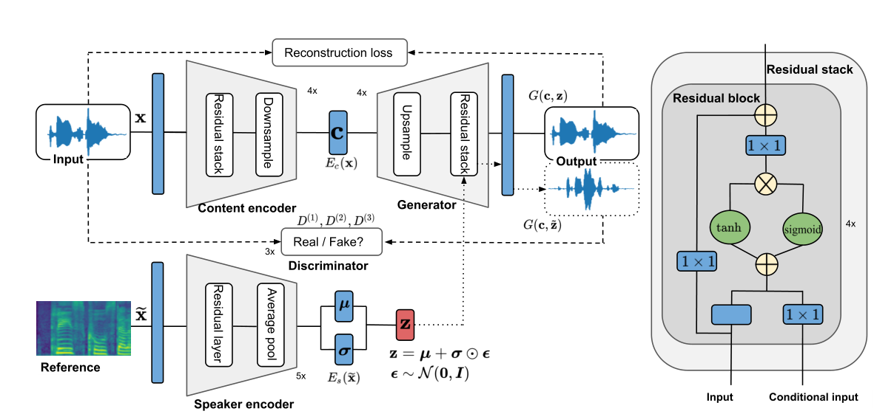

## NVC-Net: End-to-End Adversarial Voice Conversion

1. 许多VC依赖于声码器来重构语音，最终的效果很大程度上取决于声码器。
2. 本文提出NVC-Net，端到端对抗网络，直接基于波形进行转换。
3. 将说话人身份和语音内容解耦，可以实现非并行的many to many 和zero shot VC
4. NVC-Net 是非自回归、全卷积，速度快，可在NVIDIA V100 GPU产生3600 kHz信号

### Introduction

1. 早期VC采用并行数据，缺点是需要做数据对齐
2. 由于波形建模困难，提出了各种声码器，但是训练和推理过程中存在 feature mismatch
3. 本文贡献：
   + 提出NVC-Net，第一个GAN-based VC模型直接转换音频，无需声码器
   + 通过约束说话人，实现zero shot VC；在隐空间中采用KL散度提高鲁棒性，从隐空间中随机采样embedding实现输出的多样性

### NVC-Net

NVC-Net 包含一个内容编码器 $E_c$，一个说话人编码器 $E_s$，一个生成器 $G$，三个判别器 $D^{(k)}, k=1,2,3$ 被用于不同时间分辨率。其结构图为：

假设一句话 $\mathbf{x}$ 是从两个隐变量中生成：说话人身份 $\mathbf{z} \in \mathbb{R}^{d_\text{spk}}$ 和说话人内容 $\mathbf{c} \in \mathbb{R}^{d_\text{com} \times L_\text{con}}$，即 $\mathbf{x} = G(\mathbf{c}, \mathbf{z})$，其中内容在不同说话人之间保持不变，为了把一句话 $\mathbf{x}$ 从说话人 $y$ 转移到说话人 $\widetilde{y}$ 的话语 $\widetilde{\mathbf{x}}$，我们需要把 $\mathbf{x}$ 映射到内容向量 $\mathbf{c} = E_c({\mathbf{x}})$，然后从说话人编码器 $E_s({\widetilde{\mathbf{x}}})$ 中采样目标说话人向量 $\widetilde{\mathbf{z}}$，最后基于 $\widetilde{\mathbf{z}}$ 和 $\mathbf{c}$ 产生 $\widetilde{\mathbf{x}}$：$\widetilde{\mathbf{x}}=G(\mathbf{c}, \widetilde{\mathbf{z}})$。

#### 目标函数

目标是训练内容编码器 $E_c$ 、说话人编码器 $E_s$ 和 生成器 $G$ 学习说话人之间的各种映射，其中损失函数定义为：

**对抗损失**

$$
\begin{aligned} \mathcal{L}_{\text {adv }}\left(D^{(k)}\right) &=-\mathbb{E}_{\mathbf{x}, y}\left[\log D^{(k)}(\mathbf{x})[y]\right]-\mathbb{E}_{\mathbf{c}, \widetilde{\mathbf{z}}, \widetilde{y}}\left[\log \left(1-D^{(k)}(G(\mathbf{c}, \widetilde{\mathbf{z}}))[\widetilde{y}]\right)\right], \\ \mathcal{L}_{\text {adv }}\left(E_{c}, E_{s}, G\right) &=\sum_{k=1}^{3} \mathbb{E}_{\mathbf{c}, \widetilde{\mathbf{z}}, \widetilde{y}}\left[\log \left(1-D^{(k)}(G(\mathbf{c}, \widetilde{\mathbf{z}}))[\widetilde{y}]\right)\right] . \end{aligned}
$$

更新判别器的时候，只根据第 $y$ 个分支对应的判别器输出 $ D^{(k)}(\mathbf{x})[y]$ 是否正确来更新，而忽略其他的分支。

**重构损失**
可以使用point-wise直接度量波形损失，但是两个听起来相似的音频可能波形相差很大。因此使用判别器特征匹配损失：

$$
\mathcal{L}_{\mathrm{fm}}^{(k)}\left(E_{c}, E_{s}, G\right)=\mathbb{E}_{\mathbf{c}, \mathbf{z}, \mathbf{x}}\left[\sum_{i=1}^{L} \frac{1}{N_{i}}\left\|D_{i}^{(k)}(\mathbf{x})-D_{i}^{(k)}(G(\mathbf{c}, \mathbf{z}))\right\|_{1}\right]
$$

其中，$D_{k}^{(i)}$ 代表第 $k$ 个判别器的第 $i$ 层特征，$N_i$ 代表每一层的单元数，$L$ 代表层数，为了进一步提高音频的保真度，增加了谱损	失：

$$
\mathcal{L}_{\mathrm{spe}}^{(w)}\left(E_{c}, E_{s}, G\right)=\mathbb{E}_{\mathbf{c}, \mathbf{z}, \mathbf{x}}\left[\|\theta(\mathbf{x}, w)-\theta(G(\mathbf{c}, \mathbf{z}), w)\|_{2}^{2}\right]
$$

其中，$\theta(\cdot, w)$ 表示以大小为 $w$ 的FFT计算Mel谱，计算过程中采样了不同的FFT大小 $w \in \{2048, 1024, 512\}$。最后重构损失为上面两个损失的和：

$$
\mathcal{L}_{\mathrm{rec}}\left(E_{c}, E_{s}, G\right)=\sum_{k=1}^{3} \mathcal{L}_{\mathrm{fm}}^{(k)}\left(E_{c}, E_{s}, G\right)+\beta \sum_{w \in \mathcal{W}} \mathcal{L}_{\mathrm{spe}}^{(w)}\left(E_{c}, E_{s}, G\right)
$$

其中，$\beta \ge 0$ 为权重。

**内容保持损失**
为了保持转换过程中内容的不变性，最小化以下内容损失函数：

$$
\mathcal{L}_{\text {con }}\left(E_{c}, G\right)=\mathbb{E}_{\mathbf{x}, \widetilde{\mathbf{z}}}\left[\left\|E_{c}(\mathbf{x})-E_{c}\left(G\left(E_{c}(\mathbf{x}), \widetilde{\mathbf{z}}\right)\right)\right\|_{2}^{2}\right]
$$

添加这个损失有两个好处，一，确保循环转换的不变性；二，确保了说话人身份和语音内容的解耦。没有添加任何域分类损失。

**KL散度损失**
为了在说话人隐空间中进行随机采样，对说话人输出分布与先验的零均值单位方差的高斯分布的偏差添加惩罚（这一部分类似于VAE的encoder）：

$$
\mathcal{L}_{\mathrm{kl}}\left(E_{s}\right)=\mathbb{E}_{\mathbf{X}}\left[\mathbb{D}_{\mathrm{KL}}(p(\mathbf{z} \mid \mathbf{x}) \| \mathcal{N}(\mathbf{z} \mid \mathbf{0}, \mathbf{I}))\right]
$$

其中，$\mathbb{D}_\mathrm{KL}$ 代表KL散度，$p(\mathbf{z} \mid \mathbf{x})$ 表示 $E_s(\mathbf{x})$ 输出分布。这一约束使得可以从先验分布或者输出分布中采样说话人向量，其实就是在最大化对数似然 $\mathrm{log} \ p(\mathbf{x})$

最终，总损失为：

$$
\begin{aligned}
\mathcal{L}\left(E_{c}, E_{s}, G\right) &=\mathcal{L}_{\mathrm{adv}}\left(E_{c}, E_{s}, G\right)+\lambda_{\mathrm{rec}} \mathcal{L}_{\mathrm{rec}}\left(E_{c}, E_{s}, G\right)+\lambda_{\text {con }} \mathcal{L}_{\mathrm{con}}\left(E_{c}, G\right)+\lambda_{\mathrm{kl}} \mathcal{L}_{\mathrm{kl}}\left(E_{s}\right) \\
\mathcal{L}(D) &=\sum_{k=1}^{3} \mathcal{L}_{\mathrm{adv}}\left(D^{(k)}\right)
\end{aligned}
$$

其中，$\lambda_{?}$ 代表权重。

#### 模型结构

NVC-Net 的部分结构是从 MelGAN 和 WaveNet 中继承的。

##### 内容编码器

1. 全卷积网络，输入序列任意，输出长度为 $\frac {\mathrm{seq\_len}} {256}$
2. 四个下采样块，两个带GELU激活函数的卷积层
3. 每个下采样模块包括四个残差模块层叠和一个strided 卷积
4. 每个残差模块包括 dilated convolutions with gated-tanh nonlinearities and residual connections（和WaveNet相似），且 conditional input 为 None

##### 说话人编码器

1. 假设 $p(\mathbf{z} \mid \mathbf{x})$ 和高斯分布条件独立
2. 网络输出为均值 $\mathbf{\mu}$ 和对角矩阵形式的方差 $\mathbf{\sigma}^2 \mathbf{I}$，$\mathbf{I}$ 为单位阵。
3. 采用重参数技巧实现可微分。
4. 输入是音频对应的Mel谱
5. 包含五个残差模块和一个一维 dilated 卷积
6. 最后加一个平均池化去除时间维度，然后两个FC层分别输出均值和方差。

##### 生成器

1. 继承于 MelGAN，但是输入不是Mel谱而是内容编码
2. 包括四个上采样层
3. 每个上采样包含转置卷积和残差模块
4. 为了避免棋盘效应，kernel size为stride的整数倍
5. 在残差模块中添加说话人向量（学习WaveNet）

##### 判别器

1. 和MelGAN中的判别器实现相似
2. 三个判别器用于不同分辨率的音频，分为为原始音频、2倍下采样、4倍下采样
3. 判别器是多任务的，包含多个线性输出分支每个分支对应一个说话人，每个分支都是二元分类（真/假）
4. 采用 PatchGANs 的想法，判断一个窗口下的音频块的真假

#### 数据增强

1. 输入移向180°（输入波形乘以-1）
2. 随机增幅缩放
3. random shuffle：对音频分段，随机打乱顺序之后重新排列合并，能够实现更好的解耦
