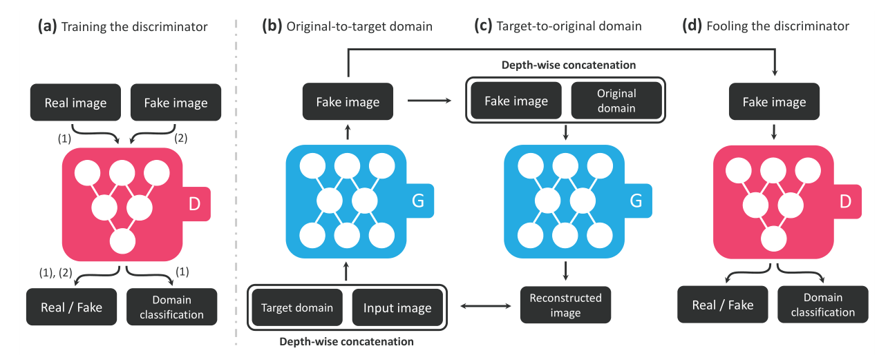

<!--
 * @Author: error: git config user.name && git config user.email & please set dead value or install git
 * @Date: 2022-07-08 10:14:21
 * @LastEditors: error: git config user.name && git config user.email & please set dead value or install git
 * @LastEditTime: 2022-07-11 14:01:39
 * @FilePath: \PA\starGAN.md
 * @Description: 这是默认设置,请设置`customMade`, 打开koroFileHeader查看配置 进行设置: https://github.com/OBKoro1/koro1FileHeader/wiki/%E9%85%8D%E7%BD%AE
-->

## StarGAN: Unified Generative Adversarial Networks for Multi-Domain Image-to-Image Translation 笔记

1. 提出StarGAN，用于图像转换（image to image），可以在一个模型下训练不同域的多种数据集
2. 在面部特征转换、表情合成方面做的实验

### Introduction

1. domain：a set of images sharing the same attribute value，其中 attribute value 为一个 attribute 的特定值（如：头发棕色、褐色、黑色等，性别男、女等）
2. 所谓的multi-domain image-to-image translation：change images according to attributes from multiple domains，在多个domain上同时改变图像的特征
3. 要实现multiple domain的图像转化，需要训练k(k−1)个生成器（两两之间就需要两个），而且训练的时候只能取一部分相关的图像，忽略了图像的全局特征
4. StarGAN：
   1. 用一个生成器（判别器自然也是一个）训练所有域之间的映射
   2. 将图像和域信息（binary 或 one-hot 向量，训练时随机生成）同时作为输入，根据域信息学习转换
   3. mask lable技术：忽略未知label，专注于特定数据集的label

### 模型原理及结构

1. 训练 $G$，将 输入图像 $x$ 基于条件 $c$ 转换成目标图像 $y$，$G(x,c) \rightarrow y$，$c$ 是随机产生的某个域。
2. 一个辅助分类器，允许判别器控制不同的域，$D: x \rightarrow\left\{D_{s r c}(x), D_{c l s}(x)\right\}$，下标 $cls$ 代表分类器。
3. 对抗损失：

$$
\begin{aligned}
\mathcal{L}_{a d v}=& \mathbb{E}_{x}\left[\log D_{s r c}(x)\right]+\\
& \mathbb{E}_{x, c}\left[\log \left(1-D_{s r c}(G(x, c))\right)\right]
\end{aligned}
$$

4. 真实图片的域分类损失 $\mathcal{L}_{c l s}^{r}$ 和fake 图片的域分类损失 $\mathcal{L}_{c l s}^{f}$ ，用来优化 $G$ （ $c^\prime$ 是原始图片对应的域）：

$$
\mathcal{L}_{c l s}^{r}=\mathbb{E}_{x, c^{\prime}}\left[-\log D_{c l s}\left(c^{\prime} \mid x\right)\right] \\
\mathcal{L}_{c l s}^{f}=\mathbb{E}_{x, c}\left[-\log D_{c l s}(c \mid G(x, c))\right]
$$

5. 重构损失（用来确保图像在转换过程中仅更改域对应的特征而保留图像原始的内容，简单来说，就是把图片和目标域 $c$ 输入生成器 $G$，输出的fake 图片再和原始域 $c^\prime$ 一起输入 $G$ ，要让前后两张图片尽可能相同）：

$$
\mathcal{L}_{r e c}=\mathbb{E}_{x, c, c^{\prime}}\left[\left\|x-G\left(G(x, c), c^{\prime}\right)\right\|_{1}\right]
$$

6. 最终，生成器和判别器的损失函数分别为：

$$
\begin{gathered}
\mathcal{L}_{D}=-\mathcal{L}_{a d v}+\lambda_{c l s} \mathcal{L}_{c l s}^{r} \\
\mathcal{L}_{G}=\mathcal{L}_{a d v}+\lambda_{c l s} \mathcal{L}_{c l s}^{f}+\lambda_{r e c} \mathcal{L}_{r e c},
\end{gathered}
$$

7. 模型结构：
   a. 对判别器，输入为real 图片和fake 图片，输出判断图片是fake还是real，同时输出图片对应的域
   bc. 对分类器，输入为real图片和待转换的域 $c$，输出fake 图片，然后会把fake 图片和real 图片的域 $c^\prime$ 输入生成器，获得重构图片用来计算重构损失。
   d. 对判别器，根据分类器输出的fake 图片来判断图片是fake 还是real，同时会输出这种图片的域分类结果，用来进行分类损失计算。
