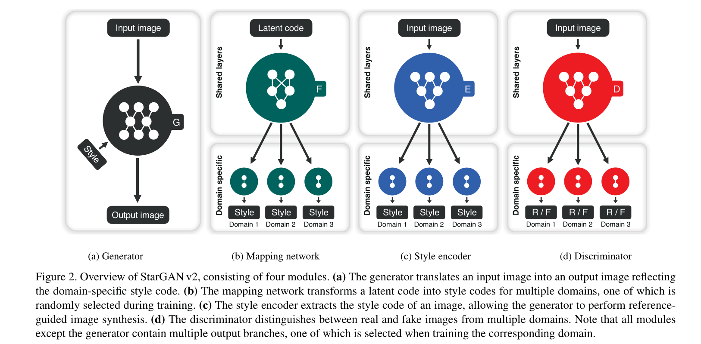

<!--
 * @Author: error: git config user.name && git config user.email & please set dead value or install git
 * @Date: 2022-07-11 15:05:23
 * @LastEditors: error: git config user.name && git config user.email & please set dead value or install git
 * @LastEditTime: 2022-07-13 11:49:26
 * @FilePath: \PA\starGANv2.md
 * @Description: 这是默认设置,请设置`customMade`, 打开koroFileHeader查看配置 进行设置: https://github.com/OBKoro1/koro1FileHeader/wiki/%E9%85%8D%E7%BD%AE
-->

## StarGAN v2: Diverse Image Synthesis for Multiple Domains 笔记

1. 好的图像转换系统需要满足：
   + 生成图片具有多样性
   + 在不同的域上有可伸缩性
2. 本文贡献：
   1. 提出 StarGAN v2
   2. 开源 AFHQ 数据集

* [ ] Introduction

1. StarGAN 可以使用一个生成器学习多域之间的转换，但是由于每个域还是会被分配一个确定的标签StarGAN学习到的映射是域之间确定的映射，不能学习到多模型数据的自然表示。
2. 由于StarGAN的输入标签是固定的，那么在给定源图像时，输入相同的域，每次转换都不可避免地产生相同的输出。
3. 本文提出了StarGANv2，能够跨域产生多样性的图片。
   1. 基于StarGAN，把域标签替换成特定的风格编码（specific style code，简称sc，下同），从而能够表征一个domain的多样的风格。
   2. 提出了两个模块，映射网络（mapping network）和风格编码器（style encoder），映射网络将随机高斯噪声转换成sc，而风格编码器将输入一张参考图片，提取其sc。在多个domain的情况下，每个模块都包含多domain的输出分支，每个分支都能产生特定域下的sc。

### StarGANv2 原理

定义 $\mathcal{X}, \mathcal{Y}$ 分别表示为图集和域domains集，则给定某张图片 $\mathbf{x}$ 和某个域 $y$，目标是训练一个单一的生成器 $G$，给定 $y$，能够基于 $\mathbf{x}$ 产生多样性的图片。在每个域domain学习特定的sc用来训练 $G$。如图所示：

1. 生成器：将输入 $\mathbf{x}$ 转换为 $G(\mathbf{x}, s)$，$s$ 代表style code，它来自于映射网络 $F$ 或者风格编码器 $E$，同时使用 AdaIN将 $s$ 引入 $G$，不再需要输入 $y$（对应于StarGAN论文中的 $c$）。
2. 映射网络：给定隐编码 $z$ 和 域domain $y$，映射网络 $F$ 产生对应的sc：$s=F_y(z)$，下标 $y$ 代表对应于域 $y$ 的映射网络（这说明，每个域doamain都对应一个独立的映射网络，更详细的说，$F$ 为一个有着多分枝输出的MLP，每个分支对应一个域）。
3. 风格编码器：风格编码器的输入为一张给定的图片和域，其输出为该图片对应的sc：${s}=E_{y}(\mathbf{x})$，使得生成器可以合成和输入 $\mathbf{x}$ 的sc 相似的图片。
4. 判别器：$D$ 也是一个多任务的判别器，有很多个输出分支。每个分支 $D_y$ 进行二值分类，确定图像 $\mathbf{x}$ 是其域 $y$ 的real图像还是由 $G$ 生成的fake图像 $G(\mathbf{x},s)$。

### 损失函数

**对抗损失**：

$$
\begin{aligned}
\mathcal{L}_{a d v}=& \mathbb{E}_{\mathbf{x}, y}\left[\log D_{y}(\mathbf{x})\right]+\\
& \mathbb{E}_{\mathbf{x}, \widetilde{y}, \mathbf{z}}\left[\log \left(1-D_{\widetilde{y}}(G(\mathbf{x}, \widetilde{\mathbf{s}}))\right)\right]
\end{aligned}
$$

其中，$z \in \mathcal{Z}, \tilde{y}\in \mathcal{Y}$ 为随机采样，然后通过映射网络得到sc： $\tilde{s} = F_{\tilde{y}}(z)$，这一部分和基本的GAN网络一致。

**风格重构损失**：

$$
\mathcal{L}_{s t y}=\mathbb{E}_{\mathbf{x}, \widetilde{y}, \mathbf{z}}\left[\left\|\widetilde{\mathbf{s}}-E_{\widetilde{y}}(G(\mathbf{x}, \widetilde{\mathbf{s}}))\right\|_{1}\right]
$$

训练一个单一的encoder学习从图片到latent code的转换，简单来说，将图片和某个 style code $\tilde{s}$ 输入生成器，得到的图片再输入风格编码器，过程前后的 style code 应该保持不变。

**风格多样性损失**：

$$
\mathcal{L}_{d s}=\mathbb{E}_{\mathbf{x}, \widetilde{y}, \mathbf{z}_{1}, \mathbf{z}_{2}}\left[\left\|G\left(\mathbf{x}, \widetilde{\mathbf{s}}_{1}\right)-G\left(\mathbf{x}, \widetilde{\mathbf{s}}_{2}\right)\right\|_{1}\right]
$$

目标为最大化该损失函数。通过把两个不同的 latent code 输入到映射网络，$\widetilde{\mathbf{s}}_{i}=F_{\widetilde{y}}\left(\mathbf{z}_{i}\right) \text { for } i \in\{1,2\}$，最大化上式使得生成器能够尽可能的生成特定风格但是又具有多样性的图片。

**循环重构损失**（保留源特征）：

$$
\mathcal{L}_{c y c}=\mathbb{E}_{\mathbf{x}, y, \widetilde{y}, \mathbf{z}}\left[\|\mathbf{x}-G(G(\mathbf{x}, \widetilde{\mathbf{s}}), \hat{\mathbf{s}})\|_{1}\right]
$$

一张图片（假设其对应的sc为 $\hat{\mathbf{s}}=E_y(\mathbf{x})$ ），通过两次生成器，在第二个生成器的sc为 $\hat{\mathbf{s}}$ 时，得到的生成图应该和原始图片一样。

总目标函数为：

$$
\begin{aligned}
\min _{G, F, E} \max _{D} & \mathcal{L}_{a d v}+\lambda_{s t y} \mathcal{L}_{s t y} \\
&-\lambda_{d s} \mathcal{L}_{d s}+\lambda_{c y c} \mathcal{L}_{c y c}
\end{aligned}
$$

$\lambda$ 为不同损失的权重。
