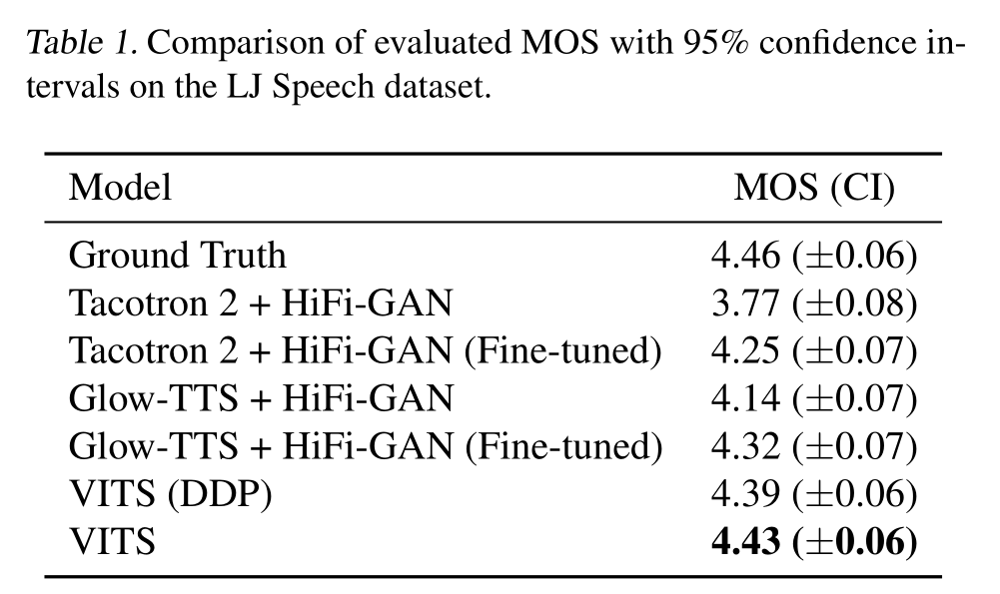
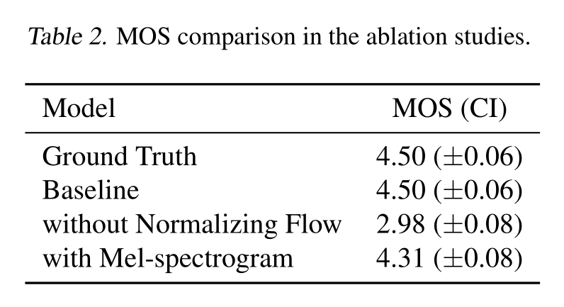

## Conditional Variational Autoencoder with Adversarial Learning for End-to-End Text-to-Speech 笔记

1. 提出并行的端到端TTS，比two stage 方法生成更自然的语音
2. 采用变分推理，加上 normalizing flows 和 对抗训练
3. 提出了随机duration预测器，合成不同节奏的语音
4. 可以表达many to one：输入文本可以以不同的音调和节奏语音输出
5. 和真实语音的MOS值相当

### Introduction
1. TTS的 two stage（两步走）：
    + 从文本中产生中间语音表征或者声学特征
    + 基于表征产生原始波形
2. 自回归的 TTS，但是无法实现并行
3. 非自回归的 TTS：attention maps、基于似然的方法、基于GAN的声码器
4 two stage的缺点：需要顺序训练和fine tune；对中间特征的依赖性削弱了模型学习的隐藏表示来进一步提高性能的能力
5. 本文贡献：
    + 采用VAE，将两个TTS模块通过隐变量连接，实现端到端
    + 在条件先验分布和对抗训练中采用了 normalizing flows
    + 提出随机duration预测器，实现 many to one 的多样性
    + 效果好于 Glow-TTS + Hifi-GAN

### 方法

#### 变分推理
1. VITS 可以看成是通过最大化ELBO的条件VAE：
$$
\log p_{\theta}(x \mid c) \geq \mathbb{E}_{q_{\phi}(z \mid x)}\left[\log p_{\theta}(x \mid z)-\log \frac{q_{\phi}(z \mid x)}{p_{\theta}(z \mid c)}\right]
$$
其中，$p_{\theta}(z \mid c)$ 表示在条件 $c$ 下隐变量 $z$ 的先验分布，$p_{\theta}(x \mid z)$ 为数据样本的似然函数，$q_{\phi}(z \mid x)$ 为近似的后验分布，训练损失函数为负ELBO，它可能被看成是重构损失 $-\log p_{\theta}(x \mid z)$ 和KL散度 $\log q_{\phi}(z \mid x) - \log p_{\theta}(z \mid c)$ 的和，其中 $z \sim q_{\phi}(z \mid x )$。

2. 重构损失：在重构损失中，采用Mel谱损失而非原始波形。通过对隐变量 $z$ 利用解码器上采样得到波形 $\hat{y}$，然后转换到Mel谱 $\hat{x}_{mel}$，重构损失定义预测波形Mel谱和真实Mel谱的L1损失：
$$
L_{recon} = \|x_{mel} - \hat{x}_{mel}\|_1
$$

3. KL散度：先验编码器的条件输入 $c$ 由从文本中提取的音素 $c_{text}$ 和音素与潜在变量之间的对齐 $A$ 组成。为了提供给后验编码器更高精度的信息，采用语谱 $x_{l i n}$ 而非Mel谱作为输入，KL散度为：
$$
\begin{gathered}
L_{k l}=\log q_{\phi}\left(z \mid x_{l i n}\right)-\log p_{\theta}\left(z \mid c_{t e x t}, A\right) \\
z \sim q_{\phi}\left(z \mid x_{l i n}\right)=N\left(z ; \mu_{\phi}\left(x_{l i n}\right), \sigma_{\phi}\left(x_{l i n}\right)\right)
\end{gathered}
$$
提高先验分布的表达能力对于生成真实样本非常重要，应用归一化流：
$$
\begin{aligned}
p_{\theta}(z \mid c) &=N\left(f_{\theta}(z) ; \mu_{\theta}(c), \sigma_{\theta}(c)\right)\left|\operatorname{det} \frac{\partial f_{\theta}(z)}{\partial z}\right| \\
c &=\left[c_{t e x t}, A\right]
\end{aligned}
$$

#### 对齐估计
1. 单调对齐搜索（MAS），通过归一化流最大数据参数的似然：
$$
\begin{aligned}
A &=\underset{\hat{A}}{\arg \max } \log p\left(x \mid c_{\text {text }}, \hat{A}\right) \\
&=\underset{\hat{A}}{\arg \max } \log N\left(f(x) ; \mu\left(c_{\text {text }}, \hat{A}\right), \sigma\left(c_{\text {text }}, \hat{A}\right)\right)
\end{aligned}
$$
通常采用动态规划进行。由于对数似然不确定，重新定义MAS，简化为找到使隐变量z的对数似然最大化的对齐方式：
$$
\begin{aligned}
A &=\underset{\hat{A}}{\arg \max } \log p\left(x \mid c_{t e x t}, \hat{A}\right) \\
&=\underset{\hat{A}}{\arg \max } \log N\left(f(x) ; \mu\left(c_{t e x t}, \hat{A}\right), \sigma\left(c_{t e x t}, \hat{A}\right)\right)
\end{aligned}
$$

2. 从文本中进行duration预测：可以通过对估计的对齐 $A$ 的每行中的所有列求和来计算每个输入token $d_i$ 的持续时间：$\sum_{j} A_{i,j}$。为了产生和人类节奏韵律相似的音频，设计了随机duration预测器SDP。
    + 基于流的生成模型
    + 无法使用最大似然估计，因为duration是离散标量
    + 采用了变分反量化（variational dequantization）和变分数据增强（variational data augmentation）
    + 引入随机变量 $u,v$ 一顿操作，最后目标函数是duration对数似然的变分下界：
    $\log p_{\theta}\left(d \mid c_{\text {text }}\right) \geq$
    $$
    \mathbb{E}_{q_{\phi}\left(u, \nu \mid d, c_{t e x t}\right)}\left[\log \frac{p_{\theta}\left(d-u, \nu \mid c_{t e x t}\right)}{q_{\phi}\left(u, \nu \mid d, c_{t e x t}\right)}\right]
    $$
    训练损失为负ELBO。采用 stop gradient operator ，使得 SDP 的训练不影响其他模块。

#### 对抗训练
1. 使用了两种损失，最小均方误差对抗损失和条件特征匹配损失：
$$
\begin{aligned}
&L_{a d v}(D)=\mathbb{E}_{(y, z)}\left[(D(y)-1)^{2}+(D(G(z)))^{2}\right] \\
&L_{a d v}(G)=\mathbb{E}_{z}\left[(D(G(z))-1)^{2}\right] \\
&L_{f m}(G)=\mathbb{E}_{(y, z)}\left[\sum_{l=1}^{T} \frac{1}{N_{l}}\left\|D^{l}(y)-D^{l}(G(z))\right\|_{1}\right]
\end{aligned}
$$
其中，$T 表示判别器的总层数，$D^{l}$ 输出判别器第 $l$ 层共有 $N_l$ 个 feature map 

#### 总损失
将VAE和GAN训练进行组合，总训练损失为：
$$
L_{v a e}=L_{r e c o n}+L_{k l}+L_{d u r}+L_{a d v}(G)+L_{f m}(G)
$$

### 模型组成
模型包含后验编码器、后验编码器、解码器、判别器和随机duration预测器。后验编码器和判别器只用在训练，不用于推理阶段。模型图如下：

1. 后验编码器：
    + non-causal WaveNet residual blocks
    + linear projection layer
2. 先验编码器：
    + 由处理输入音素 $c_{text}$ 的文本编码器和归一化流 $f_{\theta}$ 组成
    + 文本编码器为Transformer编码器
    + normalizing flow 由一堆 affine coupling layers  consisting of a stack of WaveNet residual blocks 层叠组成
    + 将归一化流设计为雅可比行列式为1的保体积变换
3. 解码器：
    + HiFi-GAN V1 的生成器，包括转置卷积、MRF组成
4. 判别器：HiFi-GAN 的判别器
5. 随机duration预测器：
    + 根据条件输入 $h_{text}$ 估计音素duration的分布
    + 层叠残差块和 dilated depth-separable convolutional layers
    + Neural spline flow

### 效果
LJ-Speech 上的效果：

消融实验结果：
